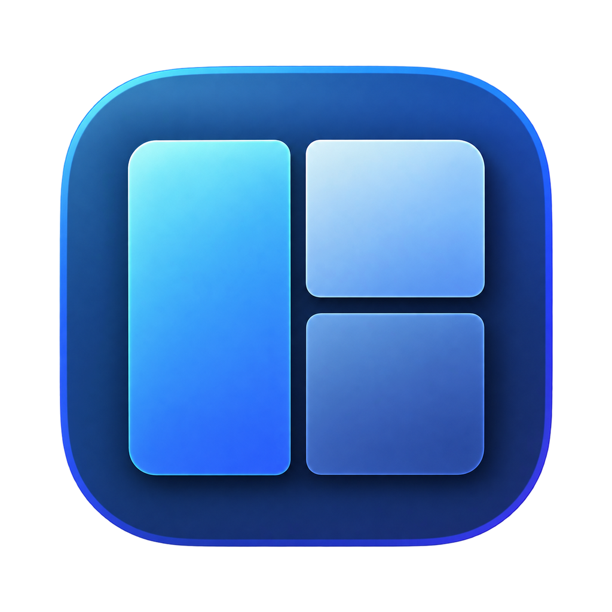
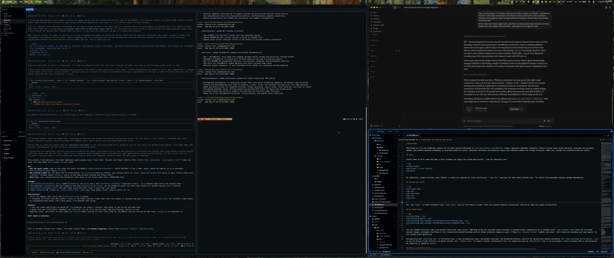

<p align="center">
  
</p>

<h1 align="center">Ballast</h1>

<p align="center">
  A tiling window manager for macOS that works <em>with</em> native Spaces instead of replacing them.<br>
  Runs with SIP fully enabled.
</p>

<p align="center">
  
</p>

---

macOS keeps owning your desktops: it creates them, switches them, and decides which
Space each window lives on. Ballast watches those changes and tiles whatever is on
each **(display, Space)** pair using that pair's layout mode.

- **Per-desktop layouts.** Each desktop on each display has its own mode:
  `master_grid` (masters beside one or two stacks, each split into
  `grid_columns` side-by-side columns that fill column-major and hold up to
  `grid_max` windows per column before the outermost column scrolls),
  `master_stack` (masters beside a stack that shows one window at a time, its
  neighbors' edges peeking, and scrolls with `focus up/down` — built for
  laptop screens), `bsp`, or `float`, where Ballast leaves the desktop alone.
  Either mode can put a stack on both sides of the master with
  `stack_both_sides`. Until you pick a mode, a laptop's built-in display gets
  `master_stack` and external displays get `master_grid`.
- **Dialogs float by default.** A window that isn't a standard resizable
  window — a settings pane, an update prompt, a confirmation sheet, anything
  modal, fixed-size, or without a full-screen button — floats over the
  window it belongs to instead of tiling. Set `float = false` on a rule, or
  use the Window Inspector's rule buttons, for the exceptions.
- **Weighted windows.** Rules give apps a weight. Heavier windows take the master
  slot and get more room, a taller stack slot or a bigger BSP tile, the moment
  they open.
- **Your arrangement stays put.** Once you swap, promote, or resize by hand,
  Ballast keeps that arrangement until you `reset`. Config reloads never undo it.
- **See where focus lands.** When a Ballast command moves focus, a border in
  the accent color flashes around the newly focused window and fades out.
  Hold Option (or the `hold` key you pick) to show the border around the
  focused window until you let go. Set it up in `[settings.focus_flash]`.
- **Settings are saved automatically.** The menu bar, the Settings window, and
  hotkeys all write to `config.toml`. Ballast changes only the values you
  changed and leaves your comments and formatting alone.
- **Fast when busy, idle when not.** Each app gets its own AX queue, so a hung
  app delays only its own windows. Ballast runs at most one layout pass per
  display frame, has no polling loops, and uses no CPU while idle.
- **Minimal private API use.** Ballast only *reads* a few SkyLight symbols to
  find out which Space each window is on. It never injects code into Dock and
  never moves windows between Spaces.

## Requirements

- macOS 14 or later (tested on 14–26)
- Swift 6 toolchain (Xcode 16 or later) to build
- In **System Settings → Desktop & Dock → Mission Control**:
  - **Displays have separate Spaces**: on (takes effect after you log out)
  - **Automatically rearrange Spaces based on most recent use**: off

If either setting is wrong, Ballast shows `! SET` in the menu bar and does not
manage any windows. Stage Manager doesn't stop Ballast, but while it is on,
every desktop floats.

## Install

There is no prebuilt download yet. Build Ballast from source.

1. **Create a signing certificate** (one time). Open Keychain Access and choose
   **Certificate Assistant → Create a Certificate**. Name it `Ballast Dev`, set
   the identity type to **Self-Signed Root**, and set the certificate type to
   **Code Signing**. The Accessibility grant is tied to this certificate, so it
   survives rebuilds.
2. **Build and install:**
   ```sh
   scripts/build-app.sh   # → build/Ballast.app, signed with "Ballast Dev"
   scripts/install.sh     # → /Applications, Start at Login on, `ballast` CLI in /usr/local/bin
   ```
3. **Grant Accessibility** when prompted: System Settings → Privacy & Security →
   Accessibility. Ballast starts managing windows right away; you don't need to
   restart it.
4. **Check the setup:**
   ```sh
   ballast doctor         # every line should be ✓
   ```

To update, run steps 2 and 4 again. The installer keeps your Start at Login
choice. To remove Ballast, run `scripts/install.sh --uninstall`; your config
and the Accessibility entry stay in place.

<details>
<summary>Build options</summary>

| Variable | Default | Effect |
|---|---|---|
| `SIGN_ID` | `Ballast Dev` | Signing identity. `SIGN_ID=-` signs ad-hoc: no certificate needed, but every rebuild loses the Accessibility grant. |
| `BIN_DIR` | `/usr/local/bin` | Where `install.sh` puts the `ballast` CLI symlink. |

</details>

## Using it

The menu bar shows the current desktop and its mode, for example `2 · MS`,
`1 · BSP`, or `3 · ⋯`. A `Z` suffix means monocle is on. Red `! …` text means
something needs your attention; open the menu to see what.

The menu, top to bottom:

1. **Adjust Desktop ▸**: the layout mode (Master-Grid, Master-Stack, BSP,
   Floating; the default one says so), this desktop's settings for that
   mode, gaps, **Remove Desktop Overrides**, and **More in Settings…**.
2. **Monocle**, **Reset Arrangement**, and **Re-layout Desktop**.
3. **The focused app ▸**: Weight (1, 2, 3, 5, 8, 13), Manage (Always or
   Never), Float (Automatic, Always, or Never), and **Inspect Window…**.
   Picking a `(default)` entry removes that key from the app's rule. This
   submenu tracks the last-focused window regardless of `manage`, so it
   stays available — with Manage ▸ **Always** one click away — even for an
   app you just set to Never and that Ballast is no longer tiling.
4. **Settings…** (`⌘,`): four tabs, General, Layout, Rules, and Keyboard.
   Global settings and the defaults for all desktops live only here. The
   Keyboard tab records hotkeys.
5. **Tools ▸**: Reload Config, Open Config File, Window Inspector…, and Run
   Doctor….

**Window Inspector…** shows the focused window's bundle id, AX role and
subrole, why it floats or tiles (or the rule that overrides that), its
weight, its Space id/uuid/ordinal and display uuid/id — with one-click
buttons to float or tile it by rule.

Drag a window onto another tile to swap the two, or onto another display to
move it there. While you drag, a highlight marks the window you'd swap with,
or where the window will land on the other display.

### Configuration

Ballast reads `~/.config/ballast/config.toml`. To use a different file, set
`$BALLAST_CONFIG` or `$XDG_CONFIG_HOME`, or pass `--config PATH`. Without a
config file, Ballast uses built-in defaults and has **no hotkeys**. Choose
**Open Config File** in the menu to create a starter file.

```toml
[layout]                     # no `mode`: master_stack on the built-in display, master_grid on external ones
master_ratio = 0.6
gaps = { inner = 8, outer = 8 }

[[space]]                    # override one desktop: `ballast spaces` prints UUIDs + ordinals
display = "640D0BA8-EB6C-4108-AA7B-E641F7C1826E"
ordinal = 1
mode = "bsp"

[[space]]                    # a one-window stack on an external desktop too
display = "6D147BFB-7E3C-4CCD-9825-F1A5A059052D"
ordinal = 1
mode = "master_stack"

[[rule]]                     # Ghostty takes the master slot from anything lighter
app_id = "com.mitchellh.ghostty"
weight = 10

[bindings]
"alt+h" = "focus left"
"alt+return" = "promote"
"alt+space" = "layout next"
```

Ballast reloads the file when you save it. If the new file is invalid,
Ballast rejects it as a whole, keeps the previous config running, and shows the
error in the menu bar. To check a file without applying it, run
`ballast check-config PATH`.

For every option and a full set of bindings, see
[`docs/config.example.toml`](docs/config.example.toml).

### Commands

You can bind any command to a hotkey in `[bindings]`, or send it with
`ballast send <command>`.

| Command | Effect |
|---|---|
| `focus left\|right\|up\|down`, `focus-last`, `focus-master` | Move focus; at a display edge, continue onto the nearest display in that direction |
| `swap left\|right\|up\|down`, `promote` | Rearrange tiles (makes the desktop manual) |
| `reset` | Drop the manual arrangement; re-rank by weight |
| `relayout` | Fix a garbled desktop: re-read its windows, forget learned minimum sizes, re-send every frame. Keeps the arrangement |
| `layout master_grid\|master_stack\|bsp\|float\|next\|prev\|default` | Change this desktop's mode |
| `monocle`, `float` | Toggle full-tile monocle / float the focused window |
| `grow [n]`, `shrink [n]`, `balance` | Resize the focused tile / even out splits |
| `master-ratio <±d>`, `master-count <±d>` | Adjust the master region (ratio clamped strictly between 5% and 95%, never reversing direction near a bound) |
| `send-to-display next\|prev`, `focus-display next\|prev` | Move a window or focus to the next/previous display |
| `reload`, `dump-state` | Reload config / write state to `~/Library/Caches/dev.ballast/state.json` |

### CLI

```text
ballast [run]                       start the window manager (menu bar app)
ballast doctor                      check permissions, Spaces settings, private API availability
ballast spaces                      list display UUIDs and Space ordinals for [[space]] config
ballast check-config [PATH]         validate a config file without applying it
ballast send <command>              send a command to the running instance
ballast login-item [on|off|status]  start at login; launchd restarts Ballast after a crash
```

## Limitations

- **No moving windows between desktops.** macOS owns Spaces. Use Mission
  Control or the Dock's **Assign To Desktop**, and Ballast lays out the window
  on its new desktop.
- **`sticky = true` is best effort.** Pinning another app's window to every
  Space needs a SIP-protected write, so sticky windows only float.
- **Some windows appear late.** Many apps report only the windows on the
  current Space, so Ballast finds windows on other desktops the first time you
  visit those desktops.
- **Private API.** The SkyLight symbols Ballast reads can change in any macOS
  update. If one disappears, Ballast shows `! OS` and stops managing windows
  instead of guessing. `ballast doctor` lists the status of each symbol.

## Development

```sh
swift build && .build/debug/ballast run   # Accessibility is granted to your terminal
swift test                                # core tests, including invariant fuzzing
scripts/lint-core.sh                      # BallastCore must not contain !, try!, fatalError, precondition
scripts/smoke-test.sh                     # live-desktop checks; see docs/SMOKE_TEST.md
```

| Target | Role |
|---|---|
| `BallastCore` | Config, rules, weights, BSP, master-grid/master-stack layouts, and the engine state machine. Pure values with no I/O, so it can be unit-tested and fuzzed. |
| `BallastApp` | macOS glue: Accessibility, read-only SkyLight, menu bar, hotkeys, and Preferences. |
| `ballast` | A single binary that serves as both the app and the CLI. |

[`docs/DESIGN.md`](docs/DESIGN.md) explains the architecture, the crash-safety
model, the animation strategy, and how Ballast handles edge cases.

## License

[MIT](LICENSE) © 2026 Andrew Hite
