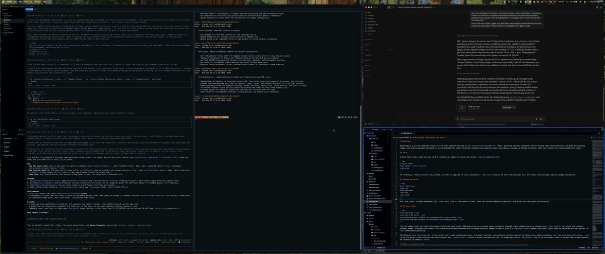

<p align="center">
  
</p>

<h1 align="center">Ballast</h1>

<p align="center">
  A tiling window manager for macOS that works <em>with</em> native Spaces instead of replacing them.<br>
  Runs with SIP fully enabled.
</p>

<p align="center">
  
</p>

---

macOS keeps owning your desktops: it creates them, switches them, and decides which
Space each window lives on. Ballast watches those changes and tiles whatever is on
each **(display, Space)** pair using that pair's arrangement settings.

- **Per-desktop layouts.** Every desktop is a **grid** of **tiles**, plus an
  optional **feature** area: a large region, on the side or in the middle,
  that holds the first windows in the order (*featured* windows). Each tile
  holds one window, or a **deck** of layered windows. You choose the grid
  with `arrange`:
  `fixed` (`columns` × `rows`: each column tiles up to `rows` windows, and
  past `columns * rows` the last column becomes a deck that scrolls with
  `rows` in view; `rows = 0` means no cap), `adaptive` (equal cells, about √n
  per side, the last row stretching), `dwindle` (a BSP spiral where new
  windows split the focused tile), `balanced` (a BSP equal-area grid), or
  `float`, where Ballast leaves the desktop alone. `feature` puts the
  feature area on the `left`, `right`, `top`, `bottom`, in the `center`
  (the grid splits into a right and a left half), or `none`;
  `feature_size` and `feature_count` size it. A window you open joins the
  top of the grid, in view.
- **Defaults follow the screen.** A display narrower than 1800 pt (every
  MacBook default resolution) is *small*, any other is *large*. Keys you
  don't set use these defaults: on a small display, `fixed` 1×1 with no
  feature (one full-screen deck); on a large one, `fixed` with `columns = 1`,
  `rows = 2`, `feature = "left"`, `feature_size = 0.6`, `feature_count = 1`.
  A key set in `[layout]` applies to every screen, and a `[[space]]`
  overrides it per desktop.
- **Floating desktops cascade.** On a `float` desktop (not under Stage
  Manager), a window that opens and would otherwise tile is moved once to the
  next free cascade slot, 28 pt down and right of the last; `float_placement =
  "none"` leaves it where the app put it.
- **Dialogs float by default.** A window that isn't a standard resizable
  window — a settings pane, an update prompt, a confirmation sheet, an Open
  or Save panel, anything modal, fixed-size, or without a full-screen
  button — floats over the window it belongs to instead of tiling. Set
  `float = false` on a rule, or use the Window Inspector's rule buttons, for
  the exceptions.
- **Weighted windows.** Rules give apps a weight. Heavier windows take the
  feature slot and get more room, a taller column slot or a bigger BSP tile,
  the moment they open.
- **Decks.** `deck left` (or right, up, down) puts the focused window in its
  neighbor's tile, and the tile becomes a deck of windows: the focused one
  fills it, the others peek out at the edges (`deck_peek` sets the strip).
  Every arrangement treats a deck as one tile; it weighs as much as its
  heaviest window. A featured window can be in a deck.
- **Monocle.** `monocle` turns every tiled window into one temporary
  full-area deck and keeps your arrangement; toggle it again to get the
  arrangement back.
- **Your arrangement stays put.** Once you swap, promote, or resize by hand,
  Ballast keeps that arrangement until you `reset`. Config reloads never undo it.
- **See where focus lands.** When a Ballast command moves focus, a border in
  the accent color flashes around the newly focused window and fades out.
  Hold Option (or the `hold` key you pick) to show the border around the
  focused window until you let go. Set it up in `[settings.focus_flash]`.
- **Settings are saved automatically.** The menu bar, the Settings window, and
  hotkeys all write to `config.toml`. Ballast changes only the values you
  changed and leaves your comments and formatting alone.
- **Fast when busy, idle when not.** Each app gets its own AX queue, so a hung
  app delays only its own windows. Ballast runs at most one layout pass per
  display frame, has no polling loops, and uses no CPU while idle.
- **Minimal private API use.** Ballast only *reads* a few SkyLight symbols to
  find out which Space each window is on. It never injects code into Dock and
  never moves windows between Spaces.

## Requirements

- macOS 14 or later (tested on 14–26)
- Swift 6 toolchain (Xcode 16 or later) to build
- In **System Settings → Desktop & Dock → Mission Control**:
  - **Displays have separate Spaces**: on (takes effect after you log out)
  - **Automatically rearrange Spaces based on most recent use**: off

If either setting is wrong, Ballast shows `! SET` in the menu bar and does not
manage any windows. Stage Manager doesn't stop Ballast, but while it is on,
every desktop floats. Another tiling window manager running at the same time
(yabai, AeroSpace, Amethyst, Rift, OmniWM) turns the menu bar title red with a
`! ` prefix, and `ballast doctor` warns about it: quit one of them.

## Install

There is no prebuilt download yet. Build Ballast from source.

1. **Create a signing certificate** (one time). Open Keychain Access and choose
   **Certificate Assistant → Create a Certificate**. Name it `Ballast Dev`, set
   the identity type to **Self-Signed Root**, and set the certificate type to
   **Code Signing**. The Accessibility grant is tied to this certificate, so it
   survives rebuilds.
2. **Build and install:**
   ```sh
   scripts/build-app.sh   # → build/Ballast.app, signed with "Ballast Dev"
   scripts/install.sh     # → /Applications, Start at Login on, `ballast` CLI linked into $BIN_DIR
   ```
   If `/usr/local/bin` isn't writable, the script prints the one command to run (or use `BIN_DIR=~/.local/bin`).
3. **Grant Accessibility** when prompted: System Settings → Privacy & Security →
   Accessibility. Ballast starts managing windows right away; you don't need to
   restart it.
4. **Check the setup:**
   ```sh
   ballast doctor         # every line ✓, or ! for the terminal's Accessibility grant
   ```
   Run from a shell, `ballast doctor` reports the *terminal's* Accessibility
   grant, which only matters for `ballast run` from that terminal; a `!` there
   is fine. **Tools ▸ Run Doctor…** in the menu bar shows Ballast.app's own
   grant. The command exits 1 only when something else is wrong.

To update, run steps 2 and 4 again. The installer keeps your Start at Login
choice. To remove Ballast, run `scripts/install.sh --uninstall`; your config
and the Accessibility entry stay in place.

<details>
<summary>Build options</summary>

| Variable | Default | Effect |
|---|---|---|
| `SIGN_ID` | `Ballast Dev` | Signing identity. `SIGN_ID=-` signs ad-hoc: no certificate needed, but every rebuild loses the Accessibility grant. |
| `BIN_DIR` | `/usr/local/bin` | Where `install.sh` puts the `ballast` CLI symlink. |

</details>

## Using it

The menu bar shows the current desktop and its layout glyph, for example
`2 · F·1×2`, `1 · D`, or `3 · ⋯`. An `F·` prefix means the desktop has a
feature area; then `C×R` is a `fixed` grid (`R` is `∞` when `rows = 0`),
`A` is `adaptive`, `D` is `dwindle`, `B` is `balanced`, and `⋯` is `float`.
A `⤢` after the glyph means monocle is on. Red `! …` text means
something needs your attention; open the menu to see what.

The menu, top to bottom:

1. **Adjust Desktop ▸**: this desktop's arrangement (Fixed, Adaptive, Dwindle,
   Balanced, Float; the default one says so), feature, and their settings,
   gaps, **Remove Desktop Overrides**, and **More in Settings…**.
2. **Monocle** (**Exit Monocle** while it is on), **Reset Arrangement**, and
   **Re-layout Desktop**.
3. **The focused app ▸**: Weight (1, 2, 3, 5, 8, 13), Manage (Always or
   Never), Float (Automatic, Always, or Never), and **Inspect Window…**.
   Picking a `(default)` entry removes that key from the app's rule. This
   submenu tracks the last-focused window regardless of `manage`, so it
   stays available — with Manage ▸ **Always** one click away — even for an
   app you just set to Never and that Ballast is no longer tiling.
4. **Settings…** (`⌘,`): four tabs, General, Layout, Rules, and Keyboard.
   Global settings and the defaults for all desktops live only here. The
   Keyboard tab records hotkeys.
5. **Tools ▸**: Reload Config, Open Config File, Window Inspector…, and Run
   Doctor….

**Window Inspector…** shows the focused window's bundle id, AX role and
subrole, why it floats or tiles (or the rule that overrides that), its
weight, its Space id/uuid/ordinal and display uuid/id — with one-click
buttons to float or tile it by rule.

Drag a window onto another tile to swap the two, or onto another display to
move it there. While you drag, a highlight marks the window you'd swap with,
or where the window will land on the other display. Drag a tile's edge to
resize: the feature boundary or the BSP split under that edge moves to where
you let go, and the tiles around it follow (the feature size is saved like
`feature-size`). An edge on the screen border, between fixed-grid columns, or
between adaptive cells gets the rule's `on_self_move` (snap back by default).

### Configuration

Ballast reads `~/.config/ballast/config.toml`. To use a different file for
`ballast run` or the CLI commands (`check-config`, `spaces`), set
`$BALLAST_CONFIG` or `$XDG_CONFIG_HOME` in your shell, or pass `--config PATH`.
The installed Ballast.app doesn't read your shell environment: it uses the
default path (or `launchctl setenv BALLAST_CONFIG …` before login), and
**Settings → General** shows the path it's using. Without a
config file, Ballast uses built-in defaults and has **no hotkeys**. Choose
**Open Config File** in the menu or in Settings to create a starter file.

```toml
[layout]                     # unset keys follow the screen: one full-screen deck on small displays, feature left on large ones
feature_size = 0.6
gaps = { inner = 8, outer = 8 }

[[space]]                    # override one desktop by its Space UUID: `ballast spaces` prints UUIDs + ordinals
uuid = "06577405-6B31-4676-9725-A2F69D4232F4"
arrange = "dwindle"

[[space]]                    # or by display UUID + position (shifts if you reorder desktops)
display = "6D147BFB-7E3C-4CCD-9825-F1A5A059052D"
ordinal = 2
arrange = "fixed"
columns = 2
rows = 3
feature = "right"

[[space]]                    # a one-window deck on an external desktop too
display = "6D147BFB-7E3C-4CCD-9825-F1A5A059052D"
ordinal = 1
arrange = "fixed"
columns = 1
rows = 1
feature = "none"

[[rule]]                     # Ghostty takes the feature slot from anything lighter
app_id = "com.mitchellh.ghostty"
weight = 10

[bindings]
"alt+h" = "focus left"
"alt+return" = "promote"
"alt+m" = "monocle"
```

Ballast reloads the file when you save it. If the new file is invalid,
Ballast rejects it as a whole, keeps the previous config running, and shows the
error in the menu bar. To check a file without applying it, run
`ballast check-config PATH`.

For every option and a full set of bindings, see
[`docs/config.example.toml`](docs/config.example.toml).

### Commands

You can bind any command to a hotkey in `[bindings]`, or send it with
`ballast send <command>`.

| Command | Effect |
|---|---|
| `focus left\|right\|up\|down`, `focus-last`, `focus-feature` | Move focus; at a display edge, continue onto the nearest display in that direction. `focus-feature` toggles focus to and from the feature |
| `focus next\|prev` | Focus the next or previous tiled window on this desktop in layout order, decks included, wrapping around |
| `swap left\|right\|up\|down`, `promote` | Rearrange tiles (makes the desktop manual). `promote` swaps the focused tile into the first feature slot |
| `deck left\|right\|up\|down`, `undeck` | Put the focused window in the tile of its neighbor that way (a *deck*: windows sharing one tile, shown like an overflow deck with the neighbors peeking; `deck_peek` sets the strip), or take it out into its own tile right after the deck. Makes the desktop manual. `focus up`/`down` move through a deck's windows. A deck left with one window dissolves; `reset` dissolves them all; float ignores them |
| `reset` | Drop the manual arrangement; re-rank by weight |
| `relayout` | Fix a garbled desktop: re-read its windows, forget learned minimum sizes, re-send every frame. Keeps the arrangement |
| `monocle`, `float` | Toggle monocle (a temporary full-area deck of every tiled window) / float the focused window |
| `close`, `fullscreen` | Press the focused window's close button (the app may ask to save) / toggle its native full screen |
| `raise-floats`, `rescue` | Bring every floating window on this desktop to the front, keeping their order (focus moves to the frontmost one) / move floating windows that are mostly off-screen to the middle of the current display |
| `grow [n]`, `shrink [n]`, `balance` | Resize: the feature size in `fixed` and `adaptive` when a feature is on, BSP split ratios in `dwindle` and `balanced`. Does nothing, and says so, when neither applies |
| `feature-size <±d>`, `feature-count <±d>` | Adjust the feature area (size clamped strictly between 5% and 95%, never reversing direction near a bound) |
| `send-to-display next\|prev`, `focus-display next\|prev` | Move a window or focus to the next/previous display |
| `reload`, `dump-state` | Reload config / write state to `~/Library/Caches/dev.ballast/state.json` |

### CLI

```text
ballast [run]                       start the window manager (menu bar app)
ballast doctor                      check permissions, Spaces settings, private API availability
ballast spaces                      list display UUIDs plus Space UUIDs and ordinals for [[space]] config
ballast check-config [PATH]         validate a config file without applying it
ballast send <command>              send a command to the running instance (fails if none is running)
ballast login-item [on|off|status]  start at login; launchd restarts Ballast after a crash
ballast help                        print usage and the command list
--config PATH | --config=PATH       use this config file instead of the default
```

## Limitations

- **No moving windows between desktops.** macOS owns Spaces. Use Mission
  Control or the Dock's **Assign To Desktop**, and Ballast lays out the window
  on its new desktop.
- **`sticky = true` is best effort.** Pinning another app's window to every
  Space needs a SIP-protected write, so sticky windows only float.
- **Some windows appear late.** Many apps report only the windows on the
  current Space, so Ballast finds windows on other desktops the first time you
  visit those desktops.
- **Private API.** The SkyLight symbols Ballast reads can change in any macOS
  update. If one disappears, Ballast shows `! OS` and stops managing windows
  instead of guessing. `ballast doctor` lists the status of each symbol.

## Development

```sh
swift build && .build/debug/ballast run   # Accessibility is granted to your terminal
swift test                                # core tests, including invariant fuzzing
scripts/lint-core.sh                      # BallastCore must not contain !, try!, fatalError, precondition
scripts/smoke-test.sh                     # live-desktop checks; see docs/SMOKE_TEST.md
```

| Target | Role |
|---|---|
| `BallastCore` | Config, rules, weights, BSP, the fixed/adaptive grids, decks, feature area, and the engine state machine. Pure values with no I/O, so it can be unit-tested and fuzzed. |
| `BallastApp` | macOS glue: Accessibility, read-only SkyLight, menu bar, hotkeys, and Preferences. |
| `ballast` | A single binary that serves as both the app and the CLI. |

[`docs/DESIGN.md`](docs/DESIGN.md) explains the architecture, the crash-safety
model, the animation strategy, and how Ballast handles edge cases.

## License

[MIT](LICENSE) © 2026 Andrew Hite
