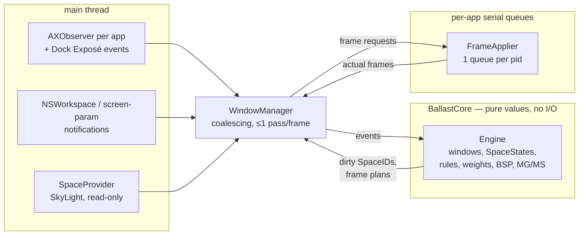

# Ballast — technical design

Ballast is a tiling window manager for macOS that lays out windows per
**(display, native macOS Space)**. It is a *reactor*: macOS owns Spaces
(creating them, switching between them, deciding which Space a window is on).
Ballast watches those native changes and lays out whatever is on each
(display, Space) using that pair's layout mode. It never writes Space state
and runs with SIP fully enabled.

## 1. Language and runtime: Swift + AppKit + AXUIElement

| | Swift + AppKit | Rust + objc2 (Rift's approach) |
|---|---|---|
| AX / AppKit / Carbon / CoreGraphics | Native; the SDK headers are the API | Needs hand-written or generated bindings; every `AXValue`, `CFArray`, and `NSScreen` crossing takes FFI glue |
| Private SkyLight reads | `dlsym` + `@convention(c)` casts | `dlsym` + `extern "C"` — equal |
| Main run loop, `AXObserver` sources, `NSStatusItem` | First-class | Works, but through `objc2` wrappers and manual run-loop plumbing |
| Recovering from a bug in the layout code | **Not possible in-process.** A Swift trap (force-unwrap of `nil`, out-of-bounds index, integer overflow) ends the process | `catch_unwind` can turn a panic in the layout code into a logged error |
| Build and distribution | SwiftPM, one binary, an optional `.app` wrapper | Cargo plus bundling; similar effort |

**Decision: Swift.** Every hot path in this WM is an AX, AppKit, or
CoreGraphics call. Swift calls them with no binding layer, so no code sits
between the WM and the APIs whose timing we care about (AX round-trips, the
display refresh rate, `NSWorkspace` notifications). The performance and
animation requirements are limited by AX IPC latency, not by the language,
so Rust's speed buys nothing measurable here.

Rust's real advantage is panic isolation. Swift has no equivalent, so Ballast
uses these mitigations instead (§2.2, §2.3):

1. The layout core is total by construction: it never traps on bad input.
2. Tree mutations are value-semantic: no half-built tree can ever be seen
   (the Rift crash class).
3. Property-based fuzz tests check this.
4. `launchd` `KeepAlive` restarts the process as a last resort.

## 2. Process architecture

One process with three layers. Only plain values cross between layers.



- **Observation** (`Sources/BallastApp/AX/AppObserver.swift`, the
  `WindowManager` notification handlers, `PrivateAPI/SkyLight.swift`).
  Everything is push-based: `AXObserver` notifications (window
  created/destroyed/moved/resized/(de)miniaturized/title-changed, focused and
  main window changed), `NSWorkspace` notifications (app
  launched/terminated/activated, active Space changed, wake, Reduce Motion
  changed), screen-parameter changes, and Dock's Mission Control (Exposé)
  enter/exit AX notifications. There are **no polling loops**. Two bounded,
  one-shot retries exist: attaching to an app that is not yet AX-ready at
  launch (≤8 tries with backoff), and re-reading the Accessibility trust
  flag 0.5 s after the system says it changed.
- **Core** (`Sources/BallastCore`, Foundation only). The `Engine` is a
  value-type state machine. It takes normalized events (`addWindow`,
  `removeWindow`, `setSpace`, `focus`, `applyConfig`, `updateSnapshot`,
  `perform(command)`, …) and returns dirty Space ids and frame plans. It has
  no clocks, no I/O, and no AX types, so the whole placement policy is
  unit-testable and fuzzable.
- **Mutation** (`AX/FrameApplier.swift`). One serial `DispatchQueue` per
  application. It receives `(element, target frame, optional animation)`,
  performs the AX writes, reads back the resulting frame, and posts it to the
  main thread. It never reads or writes engine state.

### 2.1 Isolation between computation and mutation

- The mutation path consumes only `[WindowID: CGRect]` plans. Bad layout
  output (NaN, negative sizes) cannot happen, because all geometry is clamped
  and rounded in the core. Even if it did, it would produce a refused AX write,
  not corrupted state.
- AX failures (a dead app, a timeout, a refused size) come back as values
  (`actual == nil`, or an `actual` that differs from the request). The core
  turns them into events (learn a minimum size, keep the frame it observed).
  They never throw into the core.
- Every AX element gets a 1 s messaging timeout. A hung app blocks only its
  own queue, and each read on the main thread is bounded by that timeout.

### 2.2 The Rift crash class, and why it can't happen here

Rift's `promote_to_master` crash came from an event handler that observed a
tree node in the middle of a mutation, detached but not yet re-attached, and
then called `.unwrap()` on it. Ballast removes that class of bug by
construction:

- `BSPNode` is an immutable `indirect enum`. Insert, remove, swap, resize and
  every other mutation build a **new tree** and return it whole, or return a
  `BSPError`. No code can observe an intermediate state, and no mutation
  events are emitted mid-change.
- Engine entry points are total. Unknown ids, duplicate adds, removals of
  missing windows, swaps with self, commands with no focused window, zero or
  empty areas, and snapshots that delete the Space you are on all end in a
  no-op or a message, never a trap. Tree and member drift is repaired, not
  asserted (`recomputeIdeal` rebuilds the tree if its leaves diverge from the
  members).
- The core contains no `!`, `try!`, `fatalError`, or `precondition`.
  `scripts/lint-core.sh` greps for these constructs; unchecked indexing on
  untrusted positions is covered by code review and the fuzz tests below,
  not by the lint script.
- `Tests/BallastCoreTests/FuzzTests.swift` replays thousands of seeded random
  interleavings of add, remove, re-parent (setSpace), snapshot changes that
  delete Spaces or unplug displays, config reloads, and every command. After
  **every** step it checks the structural invariants: tree leaves equal the
  Space's members equal its ideal order equal its manual order, and every
  tiled window belongs to exactly one Space.

### 2.3 What Swift cannot give us

A bug that does trap (for example, one in AppKit glue) still ends the process.
The platform layer keeps force casts to one idiom (`as! AXUIElement` right
after a `CFGetTypeID` check). The documented deployment is a LaunchAgent with
`KeepAlive` (`scripts/dev.ballast.plist`), so a crash costs about one second
of unmanaged windows. It never takes the desktop session down, because Ballast
has no injected code in Dock or WindowServer to take down with it.

## 3. Model

### 3.1 Identity

| Purpose | Key | Why |
|---|---|---|
| Config addressing | `SpaceKey(display UUID, ordinal)` | Stable across reboots, **if** "Displays have separate Spaces" is ON and "Automatically rearrange Spaces" is OFF. Otherwise Ballast refuses to manage windows (`! SET` in the menu bar) and `ballast doctor` flags the setting. The ordinal counts only *user* desktops, so full-screening an app never shifts it. |
| Live state | `SpaceID` (SkyLight managed id) | Stable for the session and follows the *physical* Space. If you delete Desktop 2, Desktop 3 becomes ordinal 2 but keeps its live state (manual arrangement, mode override), and config lookups use its new ordinal. The dead Space's state is dropped (`Engine.updateSnapshot`). |
| Displays | `CGDisplayCreateUUIDFromDisplayID` | Persistent across reconnects. It matches SkyLight's "Display Identifier". Ordinals of displays are never used. |
| Windows | `CGWindowID` (via `_AXUIElementGetWindow`) | Stable for the window's lifetime. |

### 3.2 Per-Space state: live arrangement vs. weight-computed ideal

Each `SpaceState` holds:

- `idealOrder`: `WeightResolver.rank(members)`, recomputed on every
  *structural* change (a window joins or leaves, a weight changes, a config
  reload). Pure focus changes do not recompute it; otherwise two equal-weight
  windows would swap every time you clicked one.
- `manual` + `manualOrder`: the live master order after a user
  swap/promote/drag/adopt, or a BSP resize/balance. While `manual` is set,
  the ideal keeps updating in the background but is **not applied**.
  Newcomers join the stack at their weight rank and never displace a
  manually placed master.
- `tree`: the live BSP tree. It always exists, so switching modes never
  loses structure. New windows split the focused leaf. Split ratios come
  from weights unless a split carries a manual ratio (from resize or balance).
  With `bsp_shape = "balanced"`, a Space that is not manual instead rebuilds
  its tree as the balanced ideal on every structural change: the rank order
  is cut where the running weight sum is closest to half the total, each
  side recursively, giving an equal-area grid (four equal-weight windows are
  quarters) whichever window had focus.
- `modeOverride`, `monocle`, `masterRatioOverride`, `masterCountOverride`,
  and `frameOverrides` (adopted frames). The three overrides are transient:
  a setting command applies one instantly, then the platform layer writes it
  to that desktop's `[[space]]` block in the config file (debounced ~300ms
  so a held grow/shrink key writes once, not per step) and clears the
  override, so the config is the source of truth again. If the write fails
  (invalid resulting config, unwritable file) the override is left in place
  as the effective, unsaved value and the user is notified.
- `focus`: this Space's focus history (MRU).

`reset` discards order, tree shape, and adopted frames — the *arrangement*
only. It rebuilds the BSP tree as the ideal tree in rank order: dwindle
by default (the heaviest window gets the largest, top-left tile), or the
balanced grid for `bsp_shape = "balanced"`. It **keeps** the layout mode,
monocle, master ratio and master count, because those are now config
settings, not arrangement (`layout default` still drops the mode override
by writing `mode` out of the config).

`applyConfig` re-resolves rules and recomputes ideals. It never touches the
overrides listed above. This is the direct fix for Rift's
reload-resets-layout bug, and it is covered by tests. A changed `split` is
applied to the existing BSP tree of every Space that is *not* manual (shape
and ratios kept, split directions rewritten), so config edits show up without
a `reset`; manually arranged Spaces keep their split directions until `reset`.

### 3.2.1 Config write-back

Nothing is runtime-only: every setting the user changes from the menu bar, a
setting command (`layout …`, `master-ratio`, `master-count`, master
`grow`/`shrink`/`balance`), or the Preferences window is written to
`~/.config/ballast/config.toml` so it survives restarts. Sources:

- **Menu bar / Preferences**: call `WindowManager.editConfig` or
  `setSpaceSetting` directly, synchronously, on the edit.
- **Setting commands** (hotkeys, `ballast send …`, the menu's own layout
  items — all funnel through `Engine.perform`): `CommandOutcome.settings`
  carries what changed; `WindowManager` merges it per-Space and flushes
  after a ~300ms debounce.

`WindowManager.editConfig` resolves `configURL`'s symlinks first (so a
dotfiles-managed symlink is edited in place, never replaced by a plain
file), reads the current text (the built-in starter template if the file
doesn't exist yet), applies the requested change with `ConfigEditor` — a
text-preserving TOML editor that keeps comments and formatting — validates
the result with `Config.parse`, and only then writes it atomically and
reloads. On any failure (parse/validation error, unwritable file) nothing is
written, a notification explains why, and the in-memory runtime override
stays the effective value until the next successful edit. The write informs
`ConfigWatcher` of its own content so the file-watcher's hot reload doesn't
fire a second, redundant reload.

**Surfaces.** The menu bar covers the current desktop's layout settings
(each submenu has a `Default (…)` entry that removes the desktop's override),
the `[layout]` defaults, global settings, and the focused app's `app_id`
rule. The Settings window (`Preferences/`, SwiftUI in an `NSWindow`) covers
everything: General, Layout (defaults and every connected desktop, where a
checked setting is a per-desktop override), Rules (ordered list plus a full
editor), and Keyboard (a hotkey recorder that captures key codes, so
recording doesn't depend on the keyboard layout). Text fields commit on
Return or when focus leaves, and only when the text changed. Sliders commit
when the drag ends. While the binding editor is open,
`WindowManager.setHotkeysSuspended` unregisters Ballast's global hotkeys,
so a combination that is already bound is recorded instead of running its
command.

### 3.3 Master-grid and master-stack

The ideal order is stable. Opening, closing, and focusing windows never
reorders the windows already on a Space:

- **A window joins** at the top of the stack: right after the masters and
  any heavier windows. A window heavier than a master takes the master
  slot instead. On a manual Space it goes right after the masters whatever
  its weight, so a manually placed master is never displaced.
- **A window leaves** and the rest close up; when a master leaves, the top
  of the stack takes its slot.
- **Weights change** (a config reload or a rule matching a new title): the
  order is re-sorted by weight alone, so equal-weight windows keep their
  relative places.

Windows with no place yet (a Space whose order drifted from its members)
join by `WeightResolver.rank`: weight descending, then focus recency on that
Space (focused windows before never-focused ones), then creation order, then
window id, so the result is deterministic.

- **Master-grid and master-stack**: masters are `liveOrder.prefix(masterCount)`.
  When the Space isn't manual, a weight-10 window launching next to a
  weight-1 master takes the master slot on the same layout pass.
  `master_ratio` divides the area between the master region and the
  stack region(s); inside each region, windows share its length in
  proportion to weight (a weight-2 stack window is twice as tall as a
  weight-1 one). With `stack_both_sides` off (the default), there is one
  stack region on `stack_side`. With it on, both modes put a stack on
  each side of the master along `stack_side`'s axis (left+right for
  `right`/`left`, top+bottom for `bottom`/`top`); the master keeps
  `master_ratio` of the space and the two stacks split the remainder
  evenly. The stack order is split in two: the first half (rounded up)
  goes to `stack_side`'s stack, the rest to the opposite side; with a
  single stack window, only `stack_side`'s stack is used and the layout
  matches the single-stack case exactly. The Weight
  Share Limit applies per region: no weight counts for more than
  `bsp_max_ratio / bsp_min_ratio` times the lightest (3× by default), so two
  windows split a region at most 75/25, like the two sides of a BSP split.
  Capping relative to the lightest keeps the lighter windows' proportions
  (10:2:1 counts as 3:2:1). A window whose share is below its learned AX
  minimum size gets that minimum, and the others re-share the rest by
  weight. `master_stack` always shows a one-window stack per side (§3.4);
  `master_grid` splits each stack into `grid_columns` (`LayoutSettings.
  stackColumns(in:)`) side-by-side columns, filled column-major nearest the
  master first — earlier columns take the extra when the count doesn't
  divide evenly — and tiles every window in a column unless that side grows
  past `grid_columns * grid_max`, at which point every column but the
  outermost caps at `grid_max` and the outermost column scrolls the same way
  as `master_stack` (§3.4). `grid_columns` is ignored (treated as 1) outside
  `master_grid`.
- **BSP**: each split's ratio is `sum(first subtree weights) / sum(both)`,
  clamped to `[bsp_min_ratio, bsp_max_ratio]` (the Weight Share Limit). A
  manual ratio wins. Learned AX minimum sizes are honored on top of this
  (see §4).
  Grow/shrink uses the configured BSP ratio bounds; the master layouts use the
  same ratio bounds as configuration validation, so neither command reverses
  direction at a valid starting ratio.
- **Which mode a desktop gets**: a runtime override (the menu, `layout …`)
  wins until it is written back, then the desktop's `[[space]]` mode, then
  `[layout]` mode. With neither set, `LayoutSettings.mode` stays `nil` and
  `mode(builtin:)` picks `master_stack` for a built-in display, whose small
  screen fits only one stack window, and `master_grid` for an external one.
  The SkyLight provider marks each display in the snapshot `builtin` through
  the public `CGDisplayIsBuiltin`, so the engine resolves it from the
  snapshot like everything else.

### 3.4 Scrolling stack

Each stack region (one, or two when `stack_both_sides` is on) is evaluated
independently. `master_stack` never has more than one column and scrolls
once it holds more than 1 window. `master_grid` splits a region into
`stackColumns(in: mode)` (`grid_columns`) columns; a region scrolls once it
holds more than `grid_columns * grid_max` windows (`grid_max > 0`), at which
point columns fill column-major, nearest the master first, each fixed at
`grid_max` windows except the outermost, which takes the remainder and
scrolls exactly like a single `master_stack` stack. With `grid_columns == 1`
and `stack_both_sides` off, this degenerates to the original single-stack
behavior. `grid_max == 0` means no limit: a region never scrolls, and its
columns just divide the windows evenly (earlier columns get the extra).
`MasterLayout.plan`/`stackPlan` (`MasterLayout.swift`) computes the
geometry for the scrolling (outermost) column:

- **Deck with peeks.** `grid_max` (or `stackLimit` for `master_stack`)
  equal-size slots fill the scrolling column/region.
  The stack window just before the view is shifted `stack_peek` toward the
  start, so its far edge (title bar, for a window above) shows past the
  view; the one just after is shifted `stack_peek` toward the end the same
  way. The slots give up `stack_peek` only at an end with a window beyond
  it, so a view holding the first or last stack window reaches that edge of
  the region instead of leaving an empty strip. Every other stack window is
  tucked exactly behind the first or last slot, fully hidden. Slots ignore
  weights, so a window's size changes only when the view reaches or leaves
  an end of the stack.
- **Which windows are in view.** `viewStart` is a pure function of
  `(order, shown, recent)`: the view holds `recent`'s first stack window,
  and among the starting positions that do, the one that also keeps the
  next most recent one in view wins, and so on; a remaining tie goes to the
  position nearest the start of the stack. `recent` is the Space's focus
  history filtered to stack members, so there is no separate scroll-offset
  state to keep in sync — the view is derived fresh from focus every layout
  pass.
- **Navigation.** `SpaceLayout.navigation` gives directional focus/swap a
  virtual strip that continues past both ends of the view, so `focus
  down`/`focus up` (or `left`/`right` when `stack_side` is `top`/`bottom`)
  walk into the tucked windows one at a time. `Engine.focus` dirties a Space
  whose stack scrolls, so the next layout pass pulls the newly focused window
  into view.
- **`SpaceLayout.covered`.** Windows tucked behind a view slot are recorded
  with the strip of themselves still showing (zero length along the stack
  when fully hidden). The drag hit test and the drop preview try the tiles in
  view first, then these strips, so dragging over the peeking title bar of a
  tucked window targets that window, not the one in front of it.
- **Z-order.** Each tile in view must stay in front of the windows tucked
  or peeking behind it, but macOS orders windows by focus history: a window
  focused before the view scrolled, or one whose app came forward (⌘-Tab,
  the Dock, a click on another of its windows), can end up over a tile.
  `SpaceLayout.raise` names the focused window in view, and every pass
  re-raises it. `SpaceLayout.behind` lists the other end tiles with the
  windows that belong behind them; each pass on an active Space reads the
  on-screen order (`CGWindowListCopyWindowInfo`, window numbers only) and
  raises just the tiles `tilesToRaise(frontToBack:)` finds covered, so a
  floating window over the stack stays put unless the deck is out of order.
  Two rules bound every raise: nothing goes over a focused floating or
  unmanaged window on that Space (monocle's guard), and no window of the
  focused window's app is raised but the focused window itself. `AXRaise`
  makes a window its app's focused window, which would steal focus from an
  active app; a background app's raised window comes to the front of every
  app's windows but the active app's, which is all the deck needs.
- **Why not real offscreen scrolling.** macOS won't let a titled window's
  top edge go above the menu bar or the top of a display, reassigns windows
  pushed onto a neighboring display to that display's Space instead of
  leaving them there, and clamps windows dragged fully offscreen back into
  view. Any of those would undo an actual off-strip scroll position, so the
  deck-with-peeks approach — real geometry, no off-display parking — is the
  only one that survives macOS's own window-placement rules. AeroSpace's
  accordion layout uses the same inset-and-peek idea.

## 4. Performance

- **Coalescing.** Every event marks Spaces dirty and schedules one pass,
  `1 / NSScreen.maximumFramesPerSecond` later. All events in that frame share
  the pass. Passes run on the main thread, so two passes never overlap.
- **Parallel, per-app mutation.** `FrameApplier` keeps one serial queue per
  pid. Electron and Java apps only delay their own windows.
- **Ordering.** If a window is shrinking, the size is set before the
  position. If it is growing, the position is set first. After the final
  write, the frame is read back once, and the origin is corrected if the
  WindowServer nudged it.
- **`AXEnhancedUserInterface = false`** is written to every app element on
  first contact.
- **No repeated requests.** A request equal to the last request for that
  window is not re-sent. If a window refuses a size, the actual frame is
  recorded. If it refused to *shrink*, the engine learns a minimum size and
  reflows the siblings around it (`learnMinSize`, honored by both layouts). It
  is never retried every pass.
- **Idle cost is zero**: there are no timers, no polling, and no animation
  when nothing is changing.

## 5. Animation decision: strategy (a)

**Chosen: (a).** Only the **focused** window on an **active** Space
interpolates its AX frame on its app's worker. Frames are paced by deadline at
the display refresh interval, so a slow AX round-trip drops frames instead of
stretching the animation. Every other window gets its final frame in one shot.
Each animation frame is scheduled separately on the serial queue rather than
sleeping on it. Sibling-window requests and focus operations can run between
frames.

Why not (b), yabai-style proxy windows animated with `SLSSetWindowTransform`?

- It adds private *write* APIs: window capture, transforms, and
  proxy-window ordering.
- Those APIs misbehave across macOS releases, and can leave orphaned proxy
  windows on screen if a pass is interrupted.
- It violates the "read-only SkyLight" boundary that makes §6 defensible.

(a) is SIP-safe, public API only, and keeps the eye on the window you are
working in.

Animation is skipped in each of these cases:

- **Reduce Motion is on.** `NSWorkspace.accessibilityDisplayShouldReduceMotion`
  is re-read whenever the system reports a display-options change.
- `animation.enabled = false`, or `duration_ms = 0`.
- The window is on an inactive Space or display.
- The Space is in monocle mode.

A newer request for the same window cancels an in-flight animation at its
next frame (per-window generation counter).

## 6. Private SkyLight API: scope and isolation

> **Warning.** These are undocumented private functions. Apple can change or
> remove any of them in any macOS release, including point updates, without
> notice. Ballast is tested on macOS 14–26.

- **One file**: `Sources/BallastApp/PrivateAPI/SkyLight.swift`. No other file
  references a private symbol.
- **One protocol**: `SpaceProvider` (`snapshot()`, `windowIDs(onSpace:)`,
  `spaces(forWindow:)`, `windowID(for:)`). The engine only ever sees the plain
  `SpaceSnapshot` value.
- **Read-only symbols**: `SLSMainConnectionID`,
  `SLSCopyManagedDisplaySpaces`, `SLSCopySpacesForWindows`,
  `SLSCopyWindowsWithOptionsAndTags`, and HIServices' `_AXUIElementGetWindow`.
  Nothing moves windows between Spaces, and nothing is injected into Dock.
- **Resolved once at startup** (`SkyLightSpaceProvider.make()` via
  `dlopen`/`dlsym`). If any symbol is missing, the app enters an
  `unsupported` state: a red `! OS` in the menu bar, a notification, and no
  management. `ballast doctor` lists each symbol's resolution status and
  checks that the returned data is sane: UUID display identifiers, and at
  least one user Space per display.

## 7. Spaces, displays and edge cases

| Situation | Handling |
|---|---|
| Space switch (swipe, `ctrl+N`, Mission Control) | `activeSpaceDidChange` triggers a full resync: new snapshot, discovery of windows that just became visible, and membership reconciliation. Newly active Spaces are laid out. |
| Window dragged to another Space in Mission Control | Dock posts `AXExposeExit` when Mission Control closes. Ballast then runs a full resync: a fresh snapshot (which also picks up desktops added, removed or reordered in Mission Control) and membership reconciliation (`SLSCopyWindowsWithOptionsAndTags` per Space). Both Spaces are reflowed, and the arrival is laid out using its new Space's mode. The Dock observer is re-attached whenever Dock relaunches. |
| Dock "Assign To Desktop" | When an app launches, its `com.apple.spaces` `app-bindings` entry is resolved to a `SpaceID`. The app's first windows are assigned there immediately, so their layout is computed for the Space macOS will put them on, not reflowed afterwards. |
| Space deleted | The snapshot no longer contains it, so its state is dropped. macOS moves the orphaned windows to an adjacent Space, and reconciliation reflows that Space. |
| Display unplugged or replugged, sleep/wake | `didChangeScreenParameters` / `didWake` trigger a full resync. Config overrides for the returning display re-apply by UUID. |
| Native fullscreen | Windows with `AXFullScreen` are skipped. Windows on a fullscreen-type Space are never tiled. |
| Stage Manager on | `engine.passthrough`: every Space renders as floating, and the menu says so. |
| Window moved to another display (command or drag) | A plain AX move into the target display's visible frame. macOS reassigns the Space, Ballast reconciles, and the cursor follows. |
| Moving between Spaces on one display | Not a WM function (a non-goal). |

**Discovery caveat.** For many apps, `kAXWindowsAttribute` returns only
windows on the *current* Space. Windows on Spaces you haven't visited since
launch are discovered on the first visit. This is also why an
app-moved-its-own-window check happens only for windows Ballast already
tracks.

## 8. Window-state policy

- **Focus history per Space.** When the focused window closes, focus goes to
  the most recent *older* entry in that Space's history. This still holds if
  AppKit has already focused something else: a focus loss within 0.5 s
  before the close counts.
- **Only the active app moves focus.** `AXFocusedWindowChanged` and
  `AXMainWindowChanged` count only from the frontmost app. A background app
  posts them too, when one of its windows closes or Ballast raises one to
  fix a deck, and neither moves the user's focus. An app that comes forward
  is read on `didActivateApplication`, which also covers its own
  notification arriving before `NSWorkspace` reports it frontmost.
- **Hidden applications.** Hidden windows release their tiles and are
  excluded from focus targets without being marked minimized. Unhiding an
  application restores its eligible windows to their Spaces.
- **Monocle and floating windows.** Focusing a floating window does not
  raise a tiled monocle window over it.
- **Cursor warp.** Only for WM-initiated focus that crosses a display
  (`cursor_follows_focus`). A user's own click never warps the cursor.
- **Focus flash.** When a command changes `engine.focused`, a
  click-through, accent-colored border flashes around the new focus for
  `focus_flash.duration_ms`, fading over its last 40% (at most 300 ms, and
  no fade under Reduce Motion). While the `hold` modifier is down (alone or
  with shift), the border marks the current focus, including focus changes
  from clicks. On release, a command's flash that is still running finishes
  on its own timer, one that ended during the hold plays its fade now, and
  with no command during the hold the border hides at once. Focus that
  doesn't come from a Ballast command (clicks, Cmd-Tab, focus follows mouse,
  close fallback) never flashes. The
  overlay is one AppKit window at the floating level, so the app raise that
  follows a focus change can't cover it. It is sized to the window's planned
  frame and follows that frame when a later pass scrolls the stack. It hides
  on a Space change or when the window closes.
- **Focus follows mouse (optional).** A mouse-moved global monitor, throttled
  to about 16 Hz, hit-tests the AX window under the cursor on a background
  queue, with at most one test in flight. A beachballing app under the
  cursor therefore never stalls the main thread.
- **External frame changes.** A moved or resized notification that Ballast
  didn't cause is classified at the next pass:
  - If the mouse is down, it is a user drag and waits for mouse-up. If the
    window was dropped over another tile it becomes a **swap**. If it was
    dropped on another display, the window moves there. Otherwise it snaps
    back. The drop resolves where the button was released, not wherever the
    cursor is once the app's AX read returns.
  - While the button is down, one AX read per drag tells a move (new
    position, same size) from a resize or a frame Ballast just applied. A
    move shows the **drop preview**: a click-through, accent-tinted overlay
    updated on `leftMouseDragged`. Over a tile it covers the window the drop
    would swap with, exactly the area that selects that swap. The dragged
    window can still land a different size there, because learned minimum
    sizes and weights travel with it. Over another display it covers the
    tile the window would get there, from running the move on a copy of the
    engine. The preview and the drop share one hit test. The overlay is
    Ballast's own normal-level AppKit window, ordered directly below the
    dragged one (`order(.below, relativeTo:)`), so it tints the tiles
    underneath while the window in hand stays on top: public API, no window
    capture.
  - Otherwise the rule's `on_self_move` applies. `snap_back` re-applies the
    frame. `adopt` records the window's own frame as a manual override for
    that Space.
  - A snap-back loop guard (more than 3 within 2 s) switches to adopting, so
    a grid-snapping terminal can't cause an endless fight.
- **Sticky.** Pinning another app's window to every Space requires writing
  its collection behavior. That write is SIP-gated, so it is out of scope.
  `sticky = true` is therefore **best effort**: the window floats and never
  takes a tile on any Space. Windows that are already all-Spaces (SkyLight
  reports more than one Space) are left untiled.
- **Default floating.** `WindowFacts.floatReason` (`Rules.swift`) decides
  whether a window floats when no rule sets `float` explicitly, in this
  order: role isn't `AXWindow`, subrole isn't `AXStandardWindow`, `AXModal`
  is true, `AXSize` isn't settable, then no full-screen button. Unknown
  facts count as the tiling answer, so a fact Ballast can't read never turns
  a document window into a floater. `fullScreen` is judged only while the
  window's close button reads `AXEnabled = true`: macOS removes the
  full-screen button while a sheet is attached, and a window with no title
  bar has no buttons to read either way, so both cases report `nil` instead
  of a false `.noFullScreen`. Facts are re-read on deminiaturize and unhide:
  AppKit reports a minimized window, and every window of a hidden app, as
  subrole `AXDialog`, so a window first seen in either state would otherwise
  float for good. A rule's own `float = true|false`
  always overrides the default. This is the same "no full-screen button"
  heuristic AeroSpace uses to catch settings, update and confirmation
  windows.

## 9. Config

See `docs/config.example.toml`. It is TOML, with a zero-dependency TOML 1.0
parser in `BallastCore/TOML.swift`.

**Validation.** Unknown keys, bad values, bad UUIDs, duplicate `[[space]]`
entries, bad regexes, invalid hotkeys, invalid commands, and duplicate
hotkeys are all errors, each reported with its path (`rule[3].weight: …`).

**Hot reload.** `ConfigWatcher` watches the file and directory chains for
both the configured path and its resolved symlink target. It handles atomic
saves, missing or replaced directories, symlink retargeting, and truncation.
It compares file contents and debounces notifications. An invalid file is
rejected: the old config stays live, and the menu bar shows `! …` in red with
the errors in the menu, plus a notification.
An invalid file at startup means Ballast doesn't manage windows until the
file is fixed. It never silently falls back to defaults.

## 10. Commands and IPC

Hotkeys (Carbon `RegisterEventHotKey`, which needs no event tap) and the menu
both call `WindowManager.perform(Command)`. `ballast send <command>` posts a
distributed notification to the running instance. It is fire-and-forget, the
same trust level as any local user process, and not a scripting API.
`dump-state` writes `~/Library/Caches/dev.ballast/state.json`; the smoke test
uses it.

**Window Inspector.** A non-activating floating panel
(`Sources/BallastApp/Inspector.swift`, opened from the menu) shows the
focused window's bundle id, AX role/subrole, why it floats or tiles (or the
rule that overrides that), its weight and rule index, and its Space
id/uuid/ordinal and display uuid/id. Its AX reads run on the inspected
app's `FrameApplier` worker queue, so a hung app blocks only its own
inspection, and it refreshes on `WindowManager.stateDidChange` — no polling.
Its float/tile buttons write a rule through `WindowManager.editConfig`, the
same path as every other config edit (§3.2.1).

## 11. Testing

`swift test` runs these suites:

- TOML parser
- hotkeys
- config validation
- weight resolution and tiebreaks
- BSP subtree-weight ratios and clamping
- master-grid/master-stack geometry, including scrolling-stack deck geometry and view selection
- default-floating heuristics (`WindowFacts.floatReason` precedence)
- engine behavior:
  - continuous weight-driven master
  - manual override persistence and reset
  - reload keeps live state
  - focus fallback on close
  - Space deletion and ordinal shift
- invariant fuzzing (engine and BSP)

The platform glue is covered by the manual smoke test in `docs/SMOKE_TEST.md`.

## 12. Build and install

```sh
scripts/build-app.sh      # release build → build/Ballast.app: icon, bundled LaunchAgent, signed
scripts/install.sh        # /Applications, Start at Login on, `ballast` CLI symlink
scripts/install.sh --uninstall
```

- **Bundle.** `Contents/MacOS/ballast` (the same binary serves the app and
  the CLI), `Contents/Resources/AppIcon.icns` generated from
  `assets/AppIcon.png` (1024 px, Apple icon grid), and
  `Contents/Library/LaunchAgents/dev.ballast.plist` from
  `scripts/dev.ballast.plist`. `LSUIElement` keeps it out of the Dock and the
  app switcher; the icon shows in Finder, Login Items, Accessibility settings,
  alerts and notifications.
- **Signing.** Accessibility permission is keyed to the app's designated
  requirement. `build-app.sh` signs with the `Ballast Dev` self-signed
  code-signing certificate by default (`SIGN_ID` overrides), so the
  requirement is "bundle id `dev.ballast.Ballast` + that certificate" and the
  grant survives rebuilds. The certificate does not need to be trusted.
  `SIGN_ID=-` signs ad-hoc: the requirement becomes a per-build hash and every
  rebuild loses the grant.
- **Start at Login and crash restart.** The bundled LaunchAgent is registered
  with `SMAppService` (`LoginItem.swift`), from the menu's "Start at Login"
  toggle or `ballast login-item on|off|status`. launchd starts Ballast at
  login and restarts it after a crash (`KeepAlive` on non-zero exit), but not
  after Quit. Unregistering stops the agent, so turning the toggle off quits
  Ballast; the menu asks first. Nothing is copied into `~/Library`.
- **Updates.** launchd can't relaunch an agent whose bundle was replaced
  underneath it (exit 78, `EX_CONFIG`), so `install.sh` unregisters the agent,
  waits until launchd has dropped the job, replaces the bundle and registers
  it again. Registering too soon after the swap has also produced the same
  `EX_CONFIG` respawn loop, so the script then waits up to 5 s for the agent
  to be running and, if it isn't, unregisters, waits 2 s and registers once
  more before giving up with an error. A user who turned Start at Login off
  keeps it off.
- **One instance.** `ballast run` holds a lock on
  `~/Library/Caches/dev.ballast/run.lock`. `install.sh` uses that lock to
  find a running Ballast and refuses to continue when it isn't the login
  agent (a dev `ballast run`, or a copy opened from Finder).
- **Distribution** (not set up). The Mac App Store is ruled out: its sandbox
  forbids controlling other apps' windows and private SkyLight calls. Shipping
  to other Macs needs a Developer ID certificate, hardened runtime
  (`codesign --options runtime --timestamp`), `xcrun notarytool submit` and
  `xcrun stapler staple`. No entitlements are needed.
