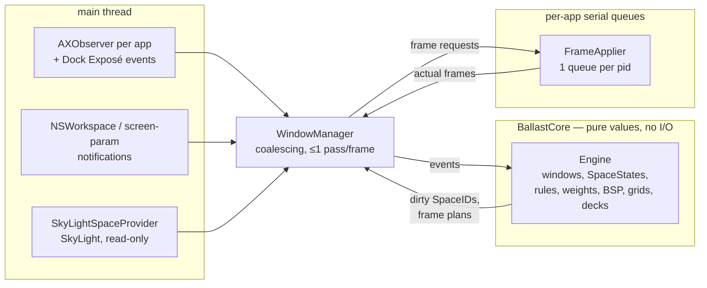

# Ballast — technical design

Ballast is a tiling window manager for macOS that lays out windows per
**(display, native macOS Space)**. It is a *reactor*: macOS owns Spaces
(creating them, switching between them, deciding which Space a window is on).
Ballast watches those native changes and lays out whatever is on each
(display, Space) using that pair's arrangement settings. It never writes Space state
and runs with SIP fully enabled.

## 1. Language and runtime: Swift + AppKit + AXUIElement

| | Swift + AppKit | Rust + objc2 (Rift's approach) |
|---|---|---|
| AX / AppKit / Carbon / CoreGraphics | Native; the SDK headers are the API | Needs hand-written or generated bindings; every `AXValue`, `CFArray`, and `NSScreen` crossing takes FFI glue |
| Private SkyLight reads | `dlsym` + `@convention(c)` casts | `dlsym` + `extern "C"` — equal |
| Main run loop, `AXObserver` sources, `NSStatusItem` | First-class | Works, but through `objc2` wrappers and manual run-loop plumbing |
| Recovering from a bug in the layout code | **Not possible in-process.** A Swift trap (force-unwrap of `nil`, out-of-bounds index, integer overflow) ends the process | `catch_unwind` can turn a panic in the layout code into a logged error |
| Build and distribution | SwiftPM, one binary, an optional `.app` wrapper | Cargo plus bundling; similar effort |

**Decision: Swift.** Every hot path in this WM is an AX, AppKit, or
CoreGraphics call. Swift calls them with no binding layer, so no code sits
between the WM and the APIs whose timing we care about (AX round-trips, the
display refresh rate, `NSWorkspace` notifications). The performance and
animation requirements are limited by AX IPC latency, not by the language,
so Rust's speed buys nothing measurable here.

Rust's real advantage is panic isolation. Swift has no equivalent, so Ballast
uses these mitigations instead (§2.2, §2.3):

1. The layout core is total by construction: it never traps on bad input.
2. Tree mutations are value-semantic: no half-built tree can ever be seen
   (the Rift crash class).
3. Property-based fuzz tests check this.
4. `launchd` `KeepAlive` restarts the process as a last resort.

## 2. Process architecture

One process with three layers. Only plain values cross between layers.


```mermaid
flowchart LR
  subgraph Observation [main thread]
    AXO[AXObserver per app<br/>+ Dock Exposé events]
    WS[NSWorkspace / screen-param<br/>notifications]
    SL[SkyLightSpaceProvider<br/>SkyLight, read-only]
  end
  subgraph Core [BallastCore — pure values, no I/O]
    E[Engine<br/>windows, SpaceStates,<br/>rules, weights, BSP, grids, decks]
  end
  subgraph Mutation [per-app serial queues]
    FA[FrameApplier<br/>1 queue per pid]
  end
  AXO --> WM[WindowManager<br/>coalescing, ≤1 pass/frame]
  WS --> WM
  SL --> WM
  WM -- events --> E
  E -- dirty SpaceIDs,<br/>frame plans --> WM
  WM -- frame requests --> FA
  FA -- actual frames --> WM
```

- **Observation** (`Sources/BallastApp/AX/AppObserver.swift`, the
  `WindowManager` notification handlers, `WindowDiscovery.swift` for window and
  native-tab discovery, `DragController.swift` for drag tracking and drop
  targets, `PrivateAPI/SkyLight.swift`).
  Everything is push-based: `AXObserver` notifications (window
  created/destroyed/moved/resized/(de)miniaturized/title-changed, focused and
  main window changed), `NSWorkspace` notifications (app
  launched/terminated/activated, active Space changed, wake, Reduce Motion
  changed), screen-parameter changes, and Dock's Mission Control (Exposé)
  enter/exit AX notifications. There are **no polling loops**. Two bounded,
  one-shot retries exist: attaching to an app that is not yet AX-ready at
  launch (≤8 tries with backoff), and re-reading the Accessibility trust
  flag 0.5 s after the system says it changed.
- **Core** (`Sources/BallastCore`, Foundation only). The `Engine` is a
  value-type state machine. It takes normalized events (`addWindow`,
  `removeWindow`, `setSpace`, `focus`, `applyConfig`, `updateSnapshot`,
  `perform(command)`, …) and returns dirty Space ids and frame plans. It has
  no clocks, no I/O, and no AX types, so the whole placement policy is
  unit-testable and fuzzable.
- **Mutation** (`AX/FrameApplier.swift`). One serial `DispatchQueue` per
  application. It receives `(element, target frame, optional animation)`,
  performs the AX writes, reads back the resulting frame, and posts it to the
  main thread. It never reads or writes engine state.

### 2.1 Isolation between computation and mutation

- The mutation path consumes only `[WindowID: CGRect]` plans. Bad layout
  output (NaN, negative sizes) cannot happen, because all geometry is clamped
  and rounded in the core. Even if it did, it would produce a refused AX write,
  not corrupted state.
- AX failures (a dead app, a timeout, a refused size) come back as values
  (`actual == nil`, or an `actual` that differs from the request). The core
  turns them into events (learn a minimum size, keep the frame it observed).
  They never throw into the core.
- Every AX element gets a 1 s messaging timeout. A hung app blocks only its
  own queue; the few AX calls left on the main thread (§4) are bounded by
  that timeout.
- The package builds in Swift 6 language mode. `WindowManager`, `ConfigStore`,
  `DragController`, `StatusBar`, the overlays and the preferences models are
  `@MainActor`. Worker-queue closures capture only values (AX elements are
  thread-safe CF objects, imported `@preconcurrency`) and hop back with
  `DispatchQueue.main.async`; C and notification callbacks that are already on
  the main thread enter isolation with `MainActor.assumeIsolated`.

### 2.2 The Rift crash class, and why it can't happen here

Rift's `promote_to_main` crash came from an event handler that observed a
tree node in the middle of a mutation, detached but not yet re-attached, and
then called `.unwrap()` on it. Ballast removes that class of bug by
construction:

- `BSPNode` is an immutable `indirect enum`. Insert, remove, swap, resize and
  every other mutation build a **new tree** and return it whole, or return a
  `BSPError`. No code can observe an intermediate state, and no mutation
  events are emitted mid-change.
- Engine entry points are total. Unknown ids, duplicate adds, removals of
  missing windows, swaps with self, commands with no focused window, zero or
  empty areas, and snapshots that delete the Space you are on all end in a
  no-op or a message, never a trap. Tree and member drift is repaired, not
  asserted (`recomputeIdeal` rebuilds the tree if its leaves diverge from the
  members).
- The core contains no `!`, `try!`, `fatalError`, or `precondition`.
  `scripts/lint-core.sh` greps for these constructs; unchecked indexing on
  untrusted positions is covered by code review and the fuzz tests below,
  not by the lint script.
- `Tests/BallastCoreTests/FuzzTests.swift` replays seeded random
  interleavings (12 seeds of 3000 steps) of add, remove, re-parent
  (setSpace), hide, native-tab swap, direct swap, snapshot changes that
  delete Spaces or unplug displays, config reloads (with random split axis,
  weight shares and gaps), and every command. After
  **every** step it checks the structural invariants: tree leaves equal the
  Space's members equal its ideal order equal its manual order, and every
  tiled window belongs to exactly one Space. A resize that reports success
  must also move the focused tile in the requested direction.

### 2.3 What Swift cannot give us

A bug that does trap (for example, one in AppKit glue) still ends the process.
The platform layer keeps force casts to one idiom (`as! AXUIElement` right
after a `CFGetTypeID` check). The documented deployment is a LaunchAgent with
`KeepAlive` (`scripts/dev.ballast.plist`), so a crash costs about one second
of unmanaged windows. It never takes the desktop session down, because Ballast
has no injected code in Dock or WindowServer to take down with it.

## 3. Model

### 3.1 Identity

| Purpose | Key | Why |
|---|---|---|
| Config addressing | `SpaceAddress`: `uuid` (the Space's UUID from `SLSCopyManagedDisplaySpaces`, as stored in `com.apple.spaces`), or `(display UUID, ordinal)` | The uuid entry follows the physical desktop through Mission Control reordering and deletion of siblings, and is what Ballast writes for new entries. The `(display, ordinal)` form is the fallback for Spaces that report no uuid, and shifts when desktops are reordered; it is stable across reboots **if** "Displays have separate Spaces" is ON and "Automatically rearrange Spaces" is OFF. Otherwise Ballast refuses to manage windows (`! SET` in the menu bar) and `ballast doctor` flags the setting. The ordinal counts only *user* desktops, so full-screening an app never shifts it. When both entries match a desktop, the uuid one wins (`Config.address(for:)`). |
| Live state | `SpaceID` (SkyLight `id64` / `ManagedSpaceID`) | Stable for the session and follows the *physical* Space. If you delete Desktop 2, Desktop 3 becomes ordinal 2 but keeps its live state (manual arrangement, setting overrides). The dead Space's state is dropped (`Engine.updateSnapshot`). Never persisted: it is re-resolved from the persisted address on every snapshot via `SpaceKey`. |
| Displays | `CGDisplayCreateUUIDFromDisplayID` | Persistent across reconnects. It matches SkyLight's "Display Identifier". Ordinals of displays are never used. |
| Windows | `CGWindowID` (via `_AXUIElementGetWindow`) | Stable for the window's lifetime. |

### 3.2 Per-Space state: live arrangement vs. weight-computed ideal

Each `SpaceState` holds:

- `idealOrder`: `WeightResolver.rank(members)`, recomputed on every
  *structural* change (a window joins or leaves, a weight changes, a config
  reload). Pure focus changes do not recompute it; otherwise two equal-weight
  windows would swap every time you clicked one.
- `manual` + `manualOrder`: the live tile order after a user
  swap/promote/drag/adopt, or a BSP resize/balance. While `manual` is set,
  the ideal keeps updating in the background but is **not applied**.
  Newcomers join after the feature tiles at their weight rank and never
  displace a manually placed featured window.
- Decks: manual decks (windows sharing one tile), keyed by the window holding
  the tile (the deck's *holder*) and listing all its windows (two at least,
  no window in two decks). `tree`, `idealOrder` and `manualOrder` hold one id
  per tile — the holder stands for the deck — so every arrangement, weight
  and minimum size sees tiles; `members` and `recentTiles` still hold every
  window. After the arrangement runs, the deck renderer (§3.4) fills a deck's
  tile rect, showing one or more windows at a time, the view chosen from
  `recentTiles`, and fills `frames`, `covered`, `behind`, `scrolling` and
  `navigation` the way an overflow deck does; a deck tucked in an overflow
  deck tucks all its windows. A tile weighs its heaviest window and needs its
  largest learned minimum size. `deck` and `undeck` mark the Space manual;
  when the holder closes or leaves, the tile passes to the next window; a
  deck that drops to one window dissolves; `reset` dissolves every manual
  deck. A featured window can be in a deck. Focusing a decked window dirties
  its Space (the view follows focus). Float ignores decks; monocle turns
  every tiled window into one temporary deck (§3.3).
- `tree`: the live BSP tree. It always exists, so switching arrangements never
  loses structure. New windows split the focused leaf. Split ratios come
  from weights unless a split carries a manual ratio (from resize or balance).
  With `arrange = "balanced"`, a Space that is not manual instead rebuilds
  its tree as the balanced ideal on every structural change: the rank order
  is cut where the running weight sum is closest to half the total, each
  side recursively, giving an equal-area grid (four equal-weight windows are
  quarters) whichever window had focus. With a feature, the tree still holds
  every tile; the feature tiles are pruned from it when drawn. The balanced
  ideal therefore splits the feature tiles off first and balances the grid
  tiles on their own, so the pruned grid is still balanced, and a
  `feature-count` change rebuilds it.
- `monocle`, transient feature-size and feature-count overrides,
  and `frameOverrides` (adopted frames). The overrides are transient:
  a setting command applies one instantly, then the platform layer writes it
  to that desktop's `[[space]]` block in the config file (debounced ~300ms
  so a held grow/shrink key writes once, not per step) and clears the
  override, so the config is the source of truth again. If the write fails
  (invalid resulting config, unwritable file) the override is left in place
  as the effective, unsaved value and the user is notified.
- `focus`: this Space's focus history (MRU).
- `recentTiles`: the tiles by when each last took focus or joined the
  Space, most recent first. It picks what a deck shows (§3.4)
  and monocle's front window, so a window that just opened shows before
  focus reaches it, or if focus never does. A window of another app than a
  focused tile on its Space joins right behind that tile instead: nothing
  can be raised over the active app's window.

`reset` discards order, tree shape, and adopted frames — the *arrangement*
only. It rebuilds the BSP tree as the ideal tree in rank order: dwindle
(the heaviest window gets the largest, top-left tile), or the
balanced grid for `arrange = "balanced"`. It **keeps** `arrange`, the feature
settings, and monocle, because those are config settings, not arrangement.

`applyConfig` re-resolves rules and recomputes ideals. It never touches the
overrides listed above. This is the direct fix for Rift's
reload-resets-layout bug, and it is covered by tests. A changed `split` is
applied to the existing BSP tree of every Space that is *not* manual (shape
and ratios kept, split directions rewritten), so config edits show up without
a `reset`; manually arranged Spaces keep their split directions until `reset`.

Live arrangement is never written to disk, and discovery after a launch
finds windows in arbitrary order (apps attach concurrently), each joining as
a newcomer. What survives a restart is the windows themselves, still where
the last run put them. So every window discovery finds already open (apps
running at launch, windows on a Space first visited since) keeps the frame
it was found at as a *seed*, and while every tile on a non-manual Space has
one, `Engine.adoptArrangement` reads the arrangement back from the seeds:
each tile takes the layout slot nearest its seed, and a tree arrangement
rebuilds its BSP shape from them (`BSPNode.fromFrames`; where frames fit
several trees, the cut layout would place closest to the measured one wins,
and a cut off its weight share keeps its measured ratio). A window opened
since, or a manual arrangement, ends it for that Space. Decks, monocle and
adopted frames are not read back.

### 3.2.1 Config write-back

Nothing is runtime-only: every setting the user changes from the menu bar, a
setting command (`feature-size`, `feature-count`, feature
`grow`/`shrink`/`balance`), or the Preferences window is written to
`~/.config/ballast/config.toml` so it survives restarts. Sources:

- **Menu bar / Preferences**: call `ConfigStore.edit` or
  `ConfigStore.setSpaceSetting` (`Sources/BallastApp/ConfigStore.swift`)
  directly, synchronously, on the edit.
- **Setting commands** (hotkeys, `ballast send …`, the menu's own arrangement
  items — all funnel through `Engine.perform`): `CommandOutcome.settings`
  carries what changed; `ConfigStore.schedulePersist` merges it per-Space and flushes
  after a ~300ms debounce.

`ConfigStore.edit` resolves the config URL's symlinks first (so a
dotfiles-managed symlink is edited in place, never replaced by a plain
file), reads the current text, applies the requested change with
`ConfigEditor` — a text-preserving TOML editor that keeps comments and
formatting and moves, removes, or skips a `[[rule]]`/`[[space]]` entry's
owned child tables (`[rule.size]`, `[space.gaps]`, ...) as a unit with it,
never orphaning or miscounting them as siblings — validates the result with
`Config.parse`, and only then writes it atomically and reloads. A key
written as a table of its own (`[layout.gaps]`, `[space.gaps]`) is
replaced as a whole: setting it drops that table and writes the value
inline, and removing it drops the table. Removing a
key from a section that doesn't exist yet (clearing an already-absent
setting) is a no-op: it never creates a phantom section or override just to
leave it empty. If the file is missing, `edit` falls back to the
built-in starter template only when no real config has ever been
successfully loaded from disk; once one has, a later disappearance (moved,
renamed, briefly absent during a dotfiles restore) fails the edit instead of
silently recreating a starter over the user's config, and the edit can be
retried once the file reappears. On any failure (parse/validation error,
unwritable file, missing file after one was already loaded) nothing is
written, a notification explains why, and the in-memory runtime override
stays the effective value until the next successful edit. The write informs
`ConfigWatcher` of its own content so the file-watcher's hot reload doesn't
fire a second, redundant reload.

**Surfaces.** The menu bar covers only what's in front of you: the current
desktop (an Adjust Desktop submenu with the arrangement and feature settings;
each has a default entry that removes the desktop's
override, and **More in Settings…** opens the Layout tab on that desktop),
monocle (**Exit Monocle** while it is on, with its bound hotkey, e.g. `Exit Monocle (⌥M)`), reset, and the `weight`/`manage`/`float` keys of the focused app's
`app_id` rule (removing the rule is Settings-only).
Global settings and the `[layout]` defaults live only in the Settings window
(`Preferences/`, SwiftUI in an `NSWindow`), which covers everything:
General, Layout (defaults and every connected desktop, where a
checked setting is a per-desktop override; in the defaults scope a key
`[layout]` does not set shows the built-in default of each screen class, and
setting it applies to every screen), Rules (ordered list plus a full
editor), and Keyboard (a hotkey recorder that captures key codes, so
recording doesn't depend on the keyboard layout). Text fields commit on
Return or when focus leaves, and only when the text changed; the Gaps
fields commit inner and outer independently, so changing one on the Layout
defaults tab never touches the other's saved value. Sliders commit
when the drag ends. While the binding editor is open,
`WindowManager.setHotkeysSuspended` unregisters Ballast's global hotkeys,
so a combination that is already bound is recorded instead of running its
command. Recording a hotkey already bound to another command (by
normalized `Hotkey` equality, so `hyper+r` and `ctrl+alt+shift+cmd+r`
still conflict) is rejected with an inline error naming the conflicting
command: neither binding is written, and the editor stays open so the user
can pick a different key.

### 3.2.2 Screen-size defaults and float cascade

A display is **small** when its visible frame is narrower than 1800 pt (every
MacBook default resolution), else **large**. The platform layer computes the
flag and puts it in the snapshot's display info next to `builtin`, so the
engine resolves settings from the snapshot like everything else. Any key not
set in `[layout]` or the desktop's `[[space]]` falls back to a built-in
default that depends on the flag:

- small: `arrange = "fixed"`, `columns = 1`, `rows = 1`, `feature = "none"` —
  one full-screen deck.
- large: `arrange = "fixed"`, `columns = 1`, `rows = 2`, `feature = "left"`,
  `feature_size = 0.6`, `feature_count = 1`.

A key set in `[layout]` applies to every screen; `[[space]]` overrides per
desktop. Precedence: runtime override, `[[space]]`, `[layout]`, built-in
default.

`float_placement = "cascade"` (default) makes `WindowManager` pass a window
that has just opened on a float Space (never at discovery, never under
Stage Manager) through `Cascade.frame`: slot k sits at the area origin plus the
outer gap plus k × 28 pt; it takes the smallest k no other window of the Space
sits at (1.5 pt tolerance), wrapping to slot 0 when the slot would push the
window out of the area; the size is clamped to the area inside the gap.

### 3.3 Arrangements, the feature area, and monocle

The ideal order is stable. Opening, closing, and focusing windows never
reorders the windows already on a Space:

- **A window joins** at the top of the grid: right after the feature tiles and
  any heavier windows. A window heavier than a featured one takes the feature
  slot instead. On a manual Space it goes right after the feature tiles
  whatever its weight, so a manually placed featured window is never
  displaced. A deck brings it into view (§3.4) without waiting for its focus.
- **A window leaves** and the rest close up; when a featured window leaves,
  the first grid tile takes its slot.
- **Weights change** (a config reload or a rule matching a new title): the
  order is re-sorted by weight alone, so equal-weight windows keep their
  relative places.

Windows with no place yet (a Space whose order drifted from its members)
join by `WeightResolver.rank`: weight descending, then focus recency on that
Space (focused windows before never-focused ones), then creation order, then
window id, so the result is deterministic.

- **Feature area**: the feature tiles are `liveOrder.prefix(feature_count)`
  in every arrangement except `float`, where for `dwindle`/`balanced`
  `liveOrder` is the tree's leaf order (`tree.leaves.prefix`); the rest go to the arrangement in the
  remaining area. `feature` picks the side (`left`, `right`, `top`,
  `bottom`) or `center`. `feature_size` divides the area between the feature
  and the grid; featured windows share the feature area's length in
  proportion to weight. With `center`, the feature sits in the middle and
  the grid is split into a right and a left half: the right half gets the
  first half of the tiles (rounded up), so one tile goes to the right only;
  the feature keeps `feature_size` of the space and the two halves split the
  remainder evenly. `feature = "none"` uses the whole area for the grid. When
  a Space isn't manual, a weight-10 window launching next to a weight-1
  featured window takes the feature slot on the same layout pass, except in
  `dwindle`, where a new window splits the focused leaf and the feature stays
  put until the tree is rebuilt.
- **fixed**: `columns` × `rows`. Columns are always vertical lines side by
  side and rows always stack top to bottom within a column, whatever side
  the feature is on (under a `top` or `bottom` feature the grid region is the
  strip below or above it, and `columns = 1`, `rows = 2` stacks two tiles
  there). The grid area is split into `columns` columns, filled column-major
  starting from the column nearest the feature (the leftmost for `top` and
  `bottom`) —
  earlier columns take the extra when the count doesn't divide evenly — and
  every tile in a column is shown unless tiles outnumber `columns * rows`,
  at which point every column but the last caps at `rows` and the last
  column becomes an overflow deck that scrolls with `rows` tiles in view
  (§3.4). `rows = 0` means no cap: nothing decks, and the columns divide the
  windows evenly. 1×1 is one full-area deck. Windows in a column share its
  length in proportion to weight (a weight-2 window is twice as tall as a
  weight-1 one). The Weight Share Limit applies per column: no weight counts
  for more than `weight_share_max / weight_share_min` times the lightest
  (3× by default), like the two sides of a BSP split. Capping relative to
  the lightest keeps the lighter windows' proportions (10:2:1 counts as
  3:2:1). A window whose share is below its learned AX minimum size gets
  that minimum, and the others re-share the rest by weight.
- **adaptive**: no size weights. The adaptive planner puts every grid window
  of `liveOrder` in an equal cell: in a landscape area (width ≥ height)
  `ceil(sqrt(n))` columns and as many rows as they need, in a portrait one
  `ceil(sqrt(n))` rows and as many columns. Windows fill the rows left to
  right, top to bottom; an incomplete last row's windows split that row's
  full width. Rows and cells are `gaps.inner` apart and honor learned
  minimum sizes through `tileLinear`/`distribute` like the other
  arrangements. Navigation follows the frames and nothing scrolls.
- **dwindle / balanced**: each split's ratio is
  `sum(first subtree weights) / sum(both)`, clamped to
  `[weight_share_min, weight_share_max]` (the Weight Share Limit). A manual
  ratio wins. Learned AX minimum sizes are honored on top of this (see §4).
  With a feature, the tree still holds every tile; the feature tiles are
  pruned at render time and the rest are laid out in the area left after the
  feature. Resize judges the pruned (drawn) splits, and says "nothing to
  resize" instead of pinning the Space manual when no drawn split changes;
  resize, balance and swap stay total.
- **Resizing**: `grow`, `shrink` and `balance` change `feature_size` in
  `fixed` and `adaptive` when a feature is on, and BSP split ratios in
  `dwindle` and `balanced`; when neither applies they do nothing and say so.
  Grow/shrink and `feature-size <±d>` clamp the feature region strictly
  between 0.05 and 0.95 — the same bound `feature_size` validation enforces
  on the config file, one Double `nextUp`/`nextDown` step inside it so the
  clamped, persisted value always parses back — and never reverse direction:
  a delta that would cross a bound instead lands the full requested delta
  short of it, so shrinking near 0.05 or growing near 0.95 keeps moving the
  same way it started. `promote` swaps the focused tile into the first
  feature slot; `focus-feature` toggles to and from it.
- **float**: the WM never touches the Space (passthrough), apart from
  Stage Manager passthrough and the cascade below.
- **Monocle** is a toggle that keeps the arrangement and renders as a
  temporary full-area 1×1 deck of every tiled window, through the deck
  renderer (§3.4): peeks apply and focus scrolls. The menu-bar title shows
  the desktop's own layout glyph followed by `⤢` while it is on, and the
  menu item reads "Exit Monocle", so it is never mistaken for a permanent
  1×1 grid. Layout glyphs: `F·` prefix when a feature is on, then `C×R` for
  `fixed` (`R` is `∞` when `rows = 0`), `A` adaptive, `D` dwindle, `B`
  balanced, `⋯` float — for example `F·1×2`, `1×1`, `D`, `⋯`.

### 3.4 Decks

A **deck** is layered windows in one cell, rendered by the deck renderer.
Manual decks (`deck`/`undeck`), overflow decks (the last `fixed` column past
`columns * rows`), 1×1 grids and monocle all use it. Each overflow deck is
evaluated independently. In a `fixed` grid a column scrolls once it holds more
than `rows` tiles. With `rows = 0` nothing scrolls. The deck planner in
`DeckLayout` (`Decks.swift`) computes the geometry for a deck:

- **Deck with peeks.** `rows` equal-size slots (one for a manual deck or
  monocle) fill the deck's area.
  The window just before the view is shifted `deck_peek` toward the
  start, so its far edge (title bar, for a window above) shows past the
  view; the one just after is shifted `deck_peek` toward the end the same
  way. The slots give up `deck_peek` only at an end with a window beyond
  it, so a view holding the first or last window reaches that edge of
  the area instead of leaving an empty strip. Every other window is
  tucked exactly behind the first or last slot, fully hidden. Slots ignore
  weights, so a window's size changes only when the view reaches or leaves
  an end of the deck.
- **Which windows are in view.** `viewStart` is a pure function of
  `(order, shown, recent)`: the view holds `recent`'s first deck window,
  and among the starting positions that do, the one that also keeps the
  next most recent one in view wins, and so on; a remaining tie goes to the
  position nearest the start of the deck. `recent` is the Space's
  `recentTiles` (§3.2): its tiles by when each last took focus or joined.
  A window that opens scrolls into view at once, though a pass can run
  before its focus reaches Ballast and some windows open without taking
  focus; focusing the feature afterwards leaves the deck where it is. There
  is no separate scroll-offset state to keep in sync — the view is derived
  fresh every layout pass.
- **Navigation.** `SpaceLayout.navigation` gives directional focus/swap a
  virtual strip that continues past both ends of the view, so `focus
  down`/`focus up` walk into the tucked windows one at a time. `Engine.focus`
  dirties a Space whose deck scrolls, so the next layout pass pulls the newly
  focused window into view.
- **`SpaceLayout.covered`.** Windows tucked behind a view slot are recorded
  with the strip of themselves still showing (zero length along the deck
  when fully hidden). The drag hit test and the drop preview try the tiles in
  view first, then these strips, so dragging over the peeking title bar of a
  tucked window targets that window, not the one in front of it.
- **Z-order.** Each tile in view must stay in front of the windows tucked
  or peeking behind it, but macOS orders windows by focus history: a window
  focused before the view scrolled, or one whose app came forward (⌘-Tab,
  the Dock, a click on another of its windows), can end up over a tile.
  `SpaceLayout.raise` names the front window (the first of `recentTiles`)
  while it is in view, and every pass re-raises it. `SpaceLayout.behind`
  lists the other end tiles with the windows that belong behind them; each
  pass on an active Space reads the on-screen order
  (`CGWindowListCopyWindowInfo`, window numbers only) and raises just the
  tiles `tilesToRaise(frontToBack:)` finds covered, so a floating window
  over a deck stays put unless the deck is out of order. Two rules bound
  every raise: nothing goes over a focused floating or unmanaged window on
  that Space (monocle's guard), and no window of the focused window's app
  is raised but the focused window itself. `AXRaise` makes a window its
  app's focused window, which would steal focus from an active app; a
  background app's raised window comes to the front of every app's windows
  but the active app's, which is all the deck needs. So a window the
  focused app just opened is not raised until its own focus arrives;
  opening it already put it in front.
- **Why not real offscreen scrolling.** macOS won't let a titled window's
  top edge go above the menu bar or the top of a display, reassigns windows
  pushed onto a neighboring display to that display's Space instead of
  leaving them there, and clamps windows dragged fully offscreen back into
  view. Any of those would undo an actual off-strip scroll position, so the
  deck-with-peeks approach — real geometry, no off-display parking — is the
  only one that survives macOS's own window-placement rules. AeroSpace's
  accordion layout uses the same inset-and-peek idea.

## 4. Performance

- **Coalescing.** Every event marks Spaces dirty and schedules one pass,
  `1 / NSScreen.maximumFramesPerSecond` later. All events in that frame share
  the pass. Passes run on the main thread, so two passes never overlap.
- **Parallel, per-app mutation.** `FrameApplier` keeps one serial queue per
  pid. Electron and Java apps only delay their own windows.
- **AX off the main thread.** Observer subscription (`AppObserver.subscribe`),
  per-window notification registration, window discovery, title and fact
  re-reads, drag probes and frame verification all run on the app's queue and
  apply on main. Registration stops at the first `.cannotComplete`, and one
  attach chain per app is in flight at a time. Frames the main thread needs
  (cascade, floating placement, flash, tab matching, Space fallback) come
  from `CGWindowListCopyWindowInfo` bounds, not AX. Remaining main-thread AX
  calls are single-window and bounded by the 1 s timeout: the facts read of a
  live `AXWindowCreated`, `_AXUIElementGetWindow` in `windowID(_:)`, and the
  Dock observer's startup.
- **Ordering.** If a window is shrinking, the size is set before the
  position. If it is growing, the position is set first. After the final
  write, the frame is read back once, and the origin is corrected if the
  WindowServer nudged it.
- **`AXEnhancedUserInterface = false`** is written to every app element on
  first contact.
- **No repeated requests.** A request equal to the last request for that
  window is not re-sent. If a window refuses to shrink on an axis, the
  engine learns a minimum size for *that axis only* and reflows the
  siblings around it (`learnMinSize`, honored by both layouts); an axis the
  window accepted leaves any earlier learned minimum on that axis alone. It
  is never retried every pass. A learned minimum only grows, so a stale one
  (read while an app was mid-resize) squeezes its siblings for good; the
  `relayout` command forgets a Space's learned minimums, clears its
  last-request cache so every frame is re-sent, and resyncs its windows.
- **Idle cost is zero**: there are no timers, no polling, and no animation
  when nothing is changing.

## 5. Animation decision: strategy (a)

**Chosen: (a).** Only the **focused** window on an **active** Space
interpolates its AX frame on its app's worker, plus, when a pass keeps the
Space's windows unchanged, every window of a deck, so
moving focus through the deck slides it instead of jumping. Those windows
mostly keep their size as the view scrolls, so a frame is
usually one position write. Frames are paced by deadline at
the display refresh interval, so a slow AX round-trip drops frames instead of
stretching the animation. Every other window gets its final frame in one shot.
Each animation frame is scheduled separately on the serial queue rather than
sleeping on it. Sibling-window requests and focus operations can run between
frames.

When focus scrolls a deck and the previously focused window slides off
the newly focused one, the newly focused window's activation and raise (and
the deck re-ordering) wait until that slide ends. The sliding window
uncovers the new one instead of being covered by it. A newer focus cancels
the wait.

Why not (b), yabai-style proxy windows animated with `SLSSetWindowTransform`?

- It adds private *write* APIs: window capture, transforms, and
  proxy-window ordering.
- Those APIs misbehave across macOS releases, and can leave orphaned proxy
  windows on screen if a pass is interrupted.
- It violates the "read-only SkyLight" boundary that makes §6 defensible.

(a) is SIP-safe, public API only, and keeps the eye on the window you are
working in.

Animation is skipped in each of these cases:

- **Reduce Motion is on.** `NSWorkspace.accessibilityDisplayShouldReduceMotion`
  is re-read whenever the system reports a display-options change.
- `animation.enabled = false`, or `duration_ms = 0`.
- The window is on an inactive Space or display.
- Monocle is on for the Space.

A newer request for the same window cancels an in-flight animation at its
next frame (per-window generation counter).

## 6. Private SkyLight API: scope and isolation

> **Warning.** These are undocumented private functions. Apple can change or
> remove any of them in any macOS release, including point updates, without
> notice. Ballast is tested on macOS 14–26.

- **One file**: `Sources/BallastApp/PrivateAPI/SkyLight.swift`. No other file
  references a private symbol.
- **One class**: `SkyLightSpaceProvider` (`snapshot()`, `activeSpaceIDs()`,
  `windowIDs(onSpace:)`, `spaces(forWindow:)`, `windowID(for:)`). Only
  `snapshot()` is main-thread-only (it reads `NSScreen`); `activeSpaceIDs()`
  and the window queries are also called from per-app worker queues. The
  engine only ever sees the plain `SpaceSnapshot` value.
- **Read-only symbols**: `SLSMainConnectionID`,
  `SLSCopyManagedDisplaySpaces`, `SLSCopySpacesForWindows`,
  `SLSCopyWindowsWithOptionsAndTags`, and HIServices' `_AXUIElementGetWindow`.
  Nothing moves windows between Spaces, and nothing is injected into Dock.
- **Resolved once at startup** (`SkyLightSpaceProvider.make()` via
  `dlopen`/`dlsym`). If any symbol is missing, the app enters an
  `unsupported` state: a red `! OS` in the menu bar, a notification, and no
  management. `ballast doctor` lists each symbol's resolution status and
  checks that the returned data is sane: UUID display identifiers, and at
  least one user Space per display.

## 7. Spaces, displays and edge cases

| Situation | Handling |
|---|---|
| Space switch (swipe, `ctrl+N`, Mission Control) | `activeSpaceDidChange` triggers a full resync: new snapshot, discovery of windows that just became visible, and membership reconciliation. Newly active Spaces are laid out. |
| Window dragged to another Space in Mission Control | Dock posts `AXExposeExit` when Mission Control closes. Ballast then runs a full resync: a fresh snapshot (which also picks up desktops added, removed or reordered in Mission Control) and membership reconciliation (`SLSCopyWindowsWithOptionsAndTags` per Space). Both Spaces are reflowed, and the arrival is laid out using its new Space's arrangement. The Dock observer is re-attached whenever Dock relaunches. |
| Dock "Assign To Desktop" | When an app launches, its `com.apple.spaces` `app-bindings` entry is resolved to a `SpaceID`. The app's first windows are assigned there immediately, so their layout is computed for the Space macOS will put them on, not reflowed afterwards. |
| Space deleted | The snapshot no longer contains it, so its state is dropped. macOS moves the orphaned windows to an adjacent Space, and reconciliation reflows that Space. |
| Display unplugged or replugged, sleep/wake | `didChangeScreenParameters` / `didWake` trigger a full resync. Config overrides for the returning display re-apply by UUID. |
| Native fullscreen | Windows with `AXFullScreen` are skipped. Windows on a fullscreen-type Space are never tiled. |
| Stage Manager on | `engine.passthrough`: every Space renders as floating, and the menu says so. |
| Another window manager running | `SystemSettings.runningWindowManagers` matches every process name (`proc_listallpids`, so launchd daemons like yabai count) against a short list of tilers. Checked at start, on app launch and quit, and when the menu opens, never polled. Ballast keeps managing; the title turns red with `! `, the menu names it, a notification fires once, and `doctor` warns. |
| Window moved to another display (command or drag) | A plain AX move into the target display's visible frame. macOS reassigns the Space, Ballast reconciles, and the cursor follows. |
| Directional focus at a display edge | If the active Space has no tile farther in that direction, focus enters the nearest display beyond that edge through its nearest visible tile. Displays without a focusable tile are skipped. |
| Moving between Spaces on one display | Not a WM function (a non-goal). |

**Discovery caveat.** For many apps, `kAXWindowsAttribute` returns only
windows on the *current* Space. Windows on Spaces you haven't visited since
launch are discovered on the first visit. This is also why an
app-moved-its-own-window check happens only for windows Ballast already
tracks. The same list drives native-tab detection (a tracked window missing
from it became a background tab), so it is judged only when the Spaces
SkyLight reports active before and after the read agree with each other and
with Ballast's snapshot. A Space switch posts app activation and focus
notifications before the resync that updates the snapshot. Judged in that
window, windows on the old Space would read as background tabs and come
back in different tiles.

## 8. Window-state policy

- **Focus history per Space.** When the focused window closes, focus goes to
  the most recent *older* entry in that Space's history. This still holds if
  AppKit has already focused something else: a focus loss within 0.5 s
  before the close counts.
- **Only the active app moves focus.** `AXFocusedWindowChanged` and
  `AXMainWindowChanged` count only from the frontmost app. A background app
  posts them too, when one of its windows closes or Ballast raises one to
  fix a deck, and neither moves the user's focus. An app that comes forward
  is read on `didActivateApplication`, which also covers its own
  notification arriving before `NSWorkspace` reports it frontmost.
- **Hidden applications.** Hidden windows release their tiles and are
  excluded from focus targets without being marked minimized. Unhiding an
  application restores its eligible windows to their Spaces.
- **Monocle and floating windows.** Focusing a floating window does not
  raise a tiled monocle deck window over it.
- **Cursor warp.** Only for WM-initiated focus that crosses a display
  (`cursor_follows_focus`). A user's own click never warps the cursor.
- **Focus flash.** When a command changes `engine.focused`, a
  click-through, accent-colored border flashes around the new focus for
  `focus_flash.duration_ms`, fading over its last 40% (at most 300 ms, and
  no fade under Reduce Motion). While the `hold` modifier is down (alone or
  with shift), the border marks the current focus, including focus changes
  from clicks. On release, a command's flash that is still running finishes
  on its own timer, one that ended during the hold plays its fade now, and
  with no command during the hold the border hides at once. Focus that
  doesn't come from a Ballast command (clicks, Cmd-Tab, focus follows mouse,
  close fallback) never flashes. The
  overlay is one AppKit window at the floating level, so the app raise that
  follows a focus change can't cover it. It is sized to the window's planned
  frame and follows that frame when a later pass scrolls the deck. It hides
  on a Space change or when the window closes.
- **Focus follows mouse (optional).** A mouse-moved global monitor, throttled
  to about 16 Hz, hit-tests the AX window under the cursor on a background
  queue, with at most one test in flight. A beachballing app under the
  cursor therefore never stalls the main thread.
- **External frame changes.** A moved or resized notification that Ballast
  didn't cause is classified at the next pass:
  - If the mouse is down, it is a user drag and waits for mouse-up. If the
    window was dropped over another tile it becomes a **swap**. If it was
    dropped on another display, the window moves there. Otherwise it snaps
    back. The drop resolves where the button was released, not wherever the
    cursor is once the app's AX read returns.
  - While the button is down, one AX read per drag tells a move (new
    position, same size) from a resize or a frame Ballast just applied. A
    move shows the **drop preview**: a click-through, accent-tinted overlay
    updated on `leftMouseDragged`. Over a tile it covers the window the drop
    would swap with, exactly the area that selects that swap. The dragged
    window can still land a different size there, because learned minimum
    sizes and weights travel with it. Over another display it covers the
    tile the window would get there, from running the move on a copy of the
    engine. The preview and the drop share one hit test. The overlay is
    Ballast's own normal-level AppKit window, ordered directly below the
    dragged one (`order(.below, relativeTo:)`), so it tints the tiles
    underneath while the window in hand stays on top: public API, no window
    capture.
  - If the window changed size while the button was down, it is a user
    **resize**. `Engine.resizeTile` takes each dragged edge in turn,
    measured against the tile's region (`tilePlan`, before decks expand,
    shifted by the window's own delta so a deck window works too). An edge
    on the feature's inner side, or a grid tile's edge facing it across the
    inner gap, sets the feature size; an edge on a BSP cut (`cutPath`: the
    deepest split along that axis with the tile on the near side, judged
    from the drawn frames, featured leaves left out) sets that split's
    ratio and makes the Space manual. The value comes from bisecting the
    parameter over real layouts until the edge lands at the drop, so
    learned minimum sizes, gaps and a centered feature need no special
    cases; results stay inside the feature-size bounds and the weight
    share limit. Neighbors follow on release, not live. An edge on no
    boundary (the area's border, fixed-grid columns, adaptive cells) falls
    through to `on_self_move` below.
  - Otherwise the rule's `on_self_move` applies. `snap_back` re-applies the
    frame. `adopt` records the window's own frame as a manual override for
    that Space.
  - A snap-back loop guard (more than 3 within 2 s) switches to adopting, so
    a grid-snapping terminal can't cause an endless fight.
- **Sticky.** Pinning another app's window to every Space requires writing
  its collection behavior. That write is SIP-gated, so it is out of scope.
  `sticky = true` is therefore **best effort**: the window floats and never
  takes a tile on any Space. Windows that are already all-Spaces (SkyLight
  reports more than one Space) are left untiled.
- **Default floating.** `WindowFacts.floatReason` (`Rules.swift`) decides
  whether a window floats when no rule sets `float` explicitly, in this
  order: role isn't `AXWindow`, subrole isn't `AXStandardWindow`,
  `AXIdentifier` is `open-panel` or `save-panel`, `AXModal` is true,
  `AXSize` isn't settable, then no full-screen button. Unknown
  facts count as the tiling answer, so a fact Ballast can't read never turns
  a document window into a floater. `fullScreen` is judged only while the
  window's close button reads `AXEnabled = true`: macOS removes the
  full-screen button while a sheet is attached, and a window with no title
  bar has no buttons to read either way, so both cases report `nil` instead
  of a false `.noFullScreen`. AppKit's Open and Save panels need the
  identifier check: shown non-modally (`begin(completionHandler:)`, e.g.
  TextEdit's File → Open…) they read as resizable, non-modal
  `AXStandardWindow`s with no title-bar buttons, sandboxed app or not, so
  every other check says "tile". Run with `runModal()` they already read as
  `AXDialog`. Facts are re-read on deminiaturize and unhide:
  AppKit reports a minimized window, and every window of a hidden app, as
  subrole `AXDialog`, so a window first seen in either state would otherwise
  float for good. A rule's own `float = true|false`
  always overrides the default. This is the same "no full-screen button"
  heuristic AeroSpace uses to catch settings, update and confirmation
  windows.

## 9. Config

See `docs/config.example.toml`. It is TOML, parsed by a zero-dependency
subset parser in `BallastCore/TOML.swift` (no datetimes or radix integers).

**Validation.** Unknown keys, bad values, bad UUIDs, duplicate `[[space]]`
entries, bad regexes, invalid hotkeys, invalid commands, and duplicate
hotkeys are all errors, each reported with its path (`rule[3].weight: …`).

**Write-back editor.** `ConfigEditor` edits the text line by line, so
comments and ordering survive. It keeps the file's own line ending (CRLF or
LF). New `[[space]]`/`[[rule]]` blocks go above the comments attached to the
header they precede, and a new first section goes after the file's header
comment. It refuses to edit (and the caller reports "could not parse
document") when a `[rule.x]`/`[space.x]` child table doesn't directly follow
its entry, because TOML would attach it to a different entry than the line
order suggests.

**Hot reload.** `ConfigWatcher` watches the file and directory chains for
both the configured path and its resolved symlink target. It handles atomic
saves, missing or replaced directories, symlink retargeting, and truncation.
It compares file contents and debounces notifications. An invalid file is
rejected: the old config stays live, and the menu bar shows `! …` in red with
the errors in the menu, plus a notification.
An invalid file at startup means Ballast doesn't manage windows until the
file is fixed. It never silently falls back to defaults.

## 10. Commands and IPC

Hotkeys (Carbon `RegisterEventHotKey`, which needs no event tap) and the menu
both call `WindowManager.perform(Command)`. `ballast send <command>` posts a
distributed notification to the running instance; it first checks that some
process holds the run lock (§12) and fails with exit 1 otherwise. Delivery is
still fire-and-forget (no acknowledgement), at the same trust level as any
local user process, and not a scripting API.
`dump-state` writes `~/Library/Caches/dev.ballast/state.json`; the smoke test
uses it.

**Window commands.** The engine only names the target; the AX work runs on
the window's app worker. `close` presses `kAXCloseButtonAttribute` (the app
may ask to save) and `fullscreen` flips `AXFullScreen`; both act on the
frontmost tracked window, managed or not. `raise-floats` brings the Space's
managed floating windows forward back to front in their current stacking,
chaining one app worker after the next so the order holds across apps. A
bare `AXRaise` never lifts a window above the active app's, so each app is
activated too and focus ends on the frontmost float. `rescue`
centers, on the current display, every managed floating window on a visible
Space that has less than half its area on any display. `focus next|prev`
walks the Space's tiled windows in layout order, decks expanded, wrapping.

**Window Inspector.** A non-activating floating panel
(`Sources/BallastApp/Inspector.swift`, opened from the menu) shows the
focused window's bundle id, AX role/subrole, why it floats or tiles (or the
rule that overrides that), its weight and rule index, and its Space
id/uuid/ordinal and display uuid/id. Its AX reads run on the inspected
app's `FrameApplier` worker queue, so a hung app blocks only its own
inspection, and it refreshes on `WindowManager.stateDidChange` — no polling.
Its float/tile buttons write a rule through `ConfigStore.edit`, the
same path as every other config edit (§3.2.1).

## 11. Testing

`swift test` covers the TOML parser, config validation, hotkeys, the layout
arrangements, and the engine, plus seeded invariant fuzzing (§2.2). CLI
argument parsing and exit codes, the `doctor` report logic, and the
Preferences helpers are covered in `Tests/BallastAppTests`. The rest of the
platform glue is covered by the manual smoke test in `docs/SMOKE_TEST.md`.

## 12. Build and install

```sh
scripts/build-app.sh      # release build → build/Ballast.app: icon, bundled LaunchAgent, signed
scripts/install.sh        # /Applications, Start at Login on, `ballast` CLI symlink
scripts/install.sh --uninstall
```

- **Bundle.** `Contents/MacOS/ballast` (the same binary serves the app and
  the CLI), `Contents/Resources/AppIcon.icns` generated from
  `assets/AppIcon.png` (1024 px, Apple icon grid), and
  `Contents/Library/LaunchAgents/dev.ballast.plist` from
  `scripts/dev.ballast.plist`. `LSUIElement` keeps it out of the Dock and the
  app switcher; the icon shows in Finder, Login Items, Accessibility settings,
  alerts and notifications.
- **Signing.** Accessibility permission is keyed to the app's designated
  requirement. `build-app.sh` signs with the `Ballast Dev` self-signed
  code-signing certificate by default (`SIGN_ID` overrides), so the
  requirement is "bundle id `dev.ballast.Ballast` + that certificate" and the
  grant survives rebuilds. The certificate does not need to be trusted.
  `SIGN_ID=-` signs ad-hoc: the requirement becomes a per-build hash and every
  rebuild loses the grant.
- **Start at Login and crash restart.** The bundled LaunchAgent is registered
  with `SMAppService` (`LoginItem.swift`), from the menu's "Start at Login"
  toggle or `ballast login-item on|off|status`. launchd starts Ballast at
  login and restarts it after a crash (`KeepAlive` on non-zero exit), but not
  after Quit. Unregistering stops the agent, so turning the toggle off quits
  Ballast; the menu asks first. Nothing is copied into `~/Library`.
- **Updates.** launchd can't relaunch an agent whose bundle was replaced
  underneath it (exit 78, `EX_CONFIG`), so `install.sh` unregisters the agent,
  waits until launchd has dropped the job, replaces the bundle and registers
  it again. Registering too soon after the swap has also produced the same
  `EX_CONFIG` respawn loop, so the script then waits up to 5 s for the agent
  to be running and, if it isn't, unregisters, waits 2 s and registers once
  more before giving up with an error. A user who turned Start at Login off
  keeps it off.
- **One instance.** `ballast run` holds a lock on
  `~/Library/Caches/dev.ballast/run.lock`. `install.sh` uses that lock to
  find a running Ballast and refuses to continue when it isn't the login
  agent (a dev `ballast run`, or a copy opened from Finder).
- **Distribution** (not set up). The Mac App Store is ruled out: its sandbox
  forbids controlling other apps' windows and private SkyLight calls. Shipping
  to other Macs needs a Developer ID certificate, hardened runtime
  (`codesign --options runtime --timestamp`), `xcrun notarytool submit` and
  `xcrun stapler staple`. No entitlements are needed.
